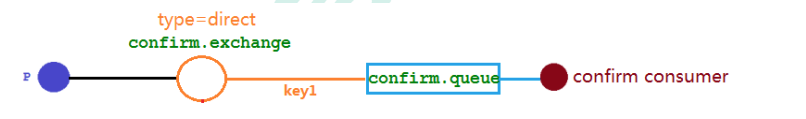

# 1.消息队列

## 1.1MQ的相关概念

### 1.1.1 什么是MQ

​        MQ(message queue)，从字面意思上看，本质是个队列，FIFO 先入先出，只不过队列中存放的内容是 message 而已，还是一种跨进程的通信机制，用于上下游传递消息。在互联网架构中，MQ 是一种非常常见的上下游“逻辑解耦+物理解耦”的消息通信服务。使用了 MQ 之后，消息发送上游只需要依赖 MQ，不用依赖其他服务。

### 1.1.2为什么要用MQ

1.流量削峰

 举个例子，如果订单系统最多能处理一万次订单，这个处理能力应付正常时段的下单时绰绰有余，正常时段我们下单一秒后就能返回结果。但是在高峰期，如果有两万次下单操作系统是处理不了的，只能限制订单超过一万后不允许用户下单。使用消息队列做缓冲，我们可以取消这个限制，把一秒内下的订单分散成一段时间来处理，这时有些用户可能在下单十几秒后才能收到下单成功的操作，但是比不能下单的体验要好。

使用MQ流量削峰如下图示例：


2.应用解耦

​		以电商应用为例，应用中有订单系统、库存系统、物流系统、支付系统。用户创建订单后，如果耦合调用库存系统、物流系统、支付系统，任何一个子系统出了故障，都会造成下单操作异常。当转变成基于消息队列的方式后，系统间调用的问题会减少很多，比如物流系统因为发生故障，需要几分钟来修复。在这几分钟的时间里，物流系统要处理的内存被缓存在消息队列中，用户的下单操作可以正常完成。当物流系统恢复后，继续处理订单信息即可，中单用户感受不到物流系统的故障，提升系统的可用性。


3.异步处理

​		有些服务间调用是异步的，例如 A 调用 B，B 需要花费很长时间执行，但是 A 需要知道 B 什么时候可以执行完，以前一般有两种方式，A 过一段时间去调用 B 的查询 api 查询。或者 A 提供一个 callback api， B 执行完之后调用 api 通知 A 服务。这两种方式都不是很优雅，使用消息总线，可以很方便解决这个问题， A 调用 B 服务后，只需要监听 B 处理完成的消息，当 B 处理完成后，会发送一条消息给 MQ，MQ 会将此消息转发给 A 服务。这样 A 服务既不用循环调用 B 的查询 api，也不用提供 callback api。同样 B 服务也不用做这些操作。A 服务还能及时的得到异步处理成功的消息。


### 1.1.3 MQ的分类

1.ActiveMQ

优点:单机吞吐量万级，时效性 ms 级，可用性高，基于主从架构实现高可用性，消息可靠性较

低的概率丢失数据
 缺点:官方社区现在对 ActiveMQ 5.x **维护越来越少，高吞吐量场景较少使用**。 尚硅谷官网视频: http://www.gulixueyuan.com/course/322

2.Kafka

大数据的杀手锏，谈到大数据领域内的消息传输，则绕不开 Kafka，这款为**大数据而生**的消息中间件， 以其**百万级** **TPS** 的吞吐量名声大噪，迅速成为大数据领域的宠儿，在数据采集、传输、存储的过程中发挥着举足轻重的作用。目前已经被 LinkedIn，Uber, Twitter, Netflix 等大公司所采纳。

优点: 性能卓越，单机写入 TPS 约在百万条/秒，最大的优点，就是**吞吐量高**。时效性 ms 级可用性非常高，kafka 是分布式的，一个数据多个副本，少数机器宕机，不会丢失数据，不会导致不可用,消费者采 用 Pull 方式获取消息, 消息有序, 通过控制能够保证所有消息被消费且仅被消费一次;有优秀的第三方 Kafka Web 管理界面 Kafka-Manager;在日志领域比较成熟，被多家公司和多个开源项目使用;功能支持: 功能较为简单，主要支持简单的 MQ 功能，在大数据领域的实时计算以及**日志采集**被大规模使用

缺点:Kafka 单机超过 64 个队列/分区，Load 会发生明显的飙高(cpu占用提高)现象，队列越多，load 越高，发送消息响应时间变长，使用短轮询方式，实时性取决于轮询间隔时间，消费失败不支持重试;支持消息顺序，但是一台代理宕机后，就会产生消息乱序，**社区更新较慢**;

3.RocketMQ

RocketMQ 出自阿里巴巴的开源产品，用 Java 语言实现，在设计时参考了 Kafka，并做出了自己的一 些改进。被阿里巴巴广泛应用在订单，交易，充值，流计算，消息推送，日志流式处理，binglog 分发等场 景。

优点:**单机吞吐量十万级**,可用性非常高，分布式架构,**消息可以做到** **0** **丢失**,**MQ 功能较为完善，还是分布式的，扩展性好,**支持 **10** **亿级别的消息堆积**，不会因为堆积导致性能下降,源码是 java 我们可以自己阅读源码，定制自己公司的 MQ

缺点:**支持的客户端语言不多**，目前是 java 及 c++，其中 c++不成熟;社区活跃度一般,没有在 MQ 核心中去实现 JMS 等接口,有些系统要迁移需要修改大量代码

4.RabbitMQ
 2007 年发布，是一个在 AMQP(高级消息队列协议)基础上完成的，可复用的企业消息系统，是**当前最主流的消息中间件之一**。

优点:由于 erlang 语言的**高并发特性**，性能较好;**吞吐量到万级**，MQ 功能比较完备,健壮、稳定、易用、跨平台、**支持多种语言** 如:Python、Ruby、.NET、Java、JMS、C、PHP、ActionScript、XMPP、STOMP 等，支持 AJAX 文档齐全;开源提供的管理界面非常棒，用起来很好用,**社区活跃度高**;更新频率相当高

https://www.rabbitmq.com/news.html 缺点:商业版需要收费,学习成本较高

### 1.1.4 MQ的选择

1.Kafka

​		Kafka 主要特点是基于 Pull 的模式来处理消息消费，追求高吞吐量，一开始的目的就是用于日志收集 和传输，适合产生**大量数据**的互联网服务的数据收集业务。**大型公司**建议可以选用，如果有**日志采集**功能， 肯定是首选 kafka 了。尚硅谷官网 kafka 视频连接 http://www.gulixueyuan.com/course/330/tasks

2.RocketMQ

​		天生为**金融互联网**领域而生，对于可靠性要求很高的场景，尤其是电商里面的订单扣款，以及业务削 峰，在大量交易涌入时，后端可能无法及时处理的情况。RoketMQ 在稳定性上可能更值得信赖，这些业务 场景在阿里双 11 已经经历了多次考验，如果你的业务有上述并发场景，建议可以选择 RocketMQ。

3.RabbitMQ
		结合 erlang 语言本身的并发优势，性能好，**时效性微秒级**，**社区活跃度也比较高**，管理界面用起来十分方便，如果你的**数据量没有那么大**，中小型公司优先选择功能比较完备的 RabbitMQ。

## **1.2. RabbitMQ**

### 1.2.1. RabbitMQ 的概念

​		RabbitMQ 是一个消息中间件:它接受并转发消息。你可以把它当做一个快递站点，当你要发送一个包裹时，你把你的包裹放到快递站，快递员最终会把你的快递送到收件人那里，按照这种逻辑 RabbitMQ 是一个快递站，一个快递员帮你传递快件。RabbitMQ 与快递站的主要区别在于，它不处理快件而是接收，存储和转发消息数据。


### 1.2.2. 四大核心概念

**生产者**

​    产生数据发送消息的程序是生产者

**交换机**

​    交换机是 RabbitMQ 非常重要的一个部件，一方面它接收来自生产者的消息，另一方面它将消息推送到队列中。交换机必须确切知道如何处理它接收到的消息，是将这些消息推送到特定队列还是推送到多个队列，亦或者是把消息丢弃，这个得有交换机类型决定

**队列**

​    队列是 RabbitMQ 内部使用的一种数据结构，尽管消息流经 RabbitMQ 和应用程序，但它们只能存储在队列中。队列仅受主机的内存和磁盘限制的约束，本质上是一个大的消息缓冲区。许多生产者可以将消息发送到一个队列，许多消费者可以尝试从一个队列接收数据。这就是我们使用队列的方式

**消费者**

​    消费与接收具有相似的含义。消费者大多时候是一个等待接收消息的程序。请注意生产者，消费者和消息中间件很多时候并不在同一机器上。同一个应用程序既可以是生产者又是可以是消费者。


**注意：**一个队列只能有一个消费者，多个消费者等待同一个队列时，只有一个消费者能获取到队列消息。

### 1.2.3. RabbitMQ 核心部分


### 1.2.4. 各个名词介绍


**Broker**:接收和分发消息的应用，RabbitMQ Server 就是 Message Broker（也叫MQ服务器/消息实体）

**Virtual host**:出于多租户和安全因素设计的，把 AMQP 的基本组件划分到一个虚拟的分组中，类似于网络中的 namespace 概念。当多个不同的用户使用同一个 RabbitMQ server 提供的服务时，可以划分出多个 vhost，每个用户在自己的 vhost 创建 exchange/queue 等

**Connection**:publisher/consumer 和 broker 之间的 **TCP 连接**

**Channel**(信道):如果每一次访问 RabbitMQ 都建立一个 Connection，在消息量大的时候建立 TCP Connection 的开销将是巨大的，效率也较低。Channel 是在 connection 内部建立的逻辑连接，如果应用程序支持多线程，通常每个 thread 创建单独的 channel 进行通讯，AMQP method 包含了 channel id 帮助客户端和 message broker 识别 channel，所以 channel 之间是完全隔离的。Channel 作为轻量级的 **Connection 极大减少了操作系统建立 TCP connection的开销**

**Exchange交换机**:message 到达 broker 的第一站，根据分发规则，匹配查询表中的 routing key，分发消息到 queue 中去。常用的类型有:direct (point-to-point), topic (publish-subscribe) and fanout (multicast)
**Queue消息队列**:消息最终被送到这里等待 consumer 取走

**Binding**:exchange 和 queue 之间的虚拟连接，binding 中可以包含 routing key，Binding 信息被保存到 exchange 中的查询表中，用于 message 的分发依据（指示交换机把消息转发到其对应的queue）

### 1.2.5. 安装

1.windows安装RabbitMQ：

https://blog.csdn.net/qq_25919879/article/details/113055350

启动服务:

sudo rabbitmq-server -detached   //参数detatched表示以守护线程方式启动

关闭服务：

sudo rabbitmqctl stop

查看状态：

sudo rabbitmqctl status

2.访问web可视化管理软件

地址：http://localhost:15672    用户名密码默认guest可访问

当以本机ip+port的形式访问，http://192.168.63.208:15672/ 会提示guest用户权限不足


需要创建新的用户：

&emsp;创建账号

&emsp;sudo rabbitmqctl add_user admin 123

&emsp;设置用户角色

&emsp;sudo rabbitmqctl set_user_tags admin administrator

&emsp;设置用户权限set_permissions [-p <vhostpath>] <user> <conf> <write> <read> 

   sudo rabbitmqctl set_permissions -p "/" admin ".*" ".*" ".*"

&emsp;用户 user_admin 具有/vhost1 这个 virtual host 中所有资源的配置、写、读权限

&emsp;列出当前用户和角色

&emsp;sudo rabbitmqctl list_users

# 2.创建Java环境-HelloWorld

​    在本教程的这一部分中，我们将用 Java 编写两个程序。发送单个消息的生产者和接收消息并打印出来的消费者。我们将介绍 Java API 中的一些细节。

​    在下图中，“ P”是我们的生产者，“ C”是我们的消费者。中间的框是一个队列-RabbitMQ 代 表使用者保留的消息缓冲区，实现**简单队列模式**，**即暂时不考虑交换机**。


IDEA创建一个空工程，命名为atguigu-rabbitMQ;（先修改maven位置）

创建一个maven模块，命名为rabbitmq-hello，jkd1.8，组名com.atguigu.rabbitmq；

在project_structure的project setting中修改项目java版本为8；

将pom.xml文件修改如下:


## 2.1 添加依赖

 pom.xml添加如下依赖：

```xml
<!--指定jdk编译版本-->
<build>
    <plugins>
      <plugin>
        <groupId>org.apache.maven.plugins</groupId>
        <artifactId>maven-compiler-plugin</artifactId>
        <version>3.8.1</version>
        <configuration>
          <source>8</source>
          <target>8</target>
        </configuration>
      </plugin>
    </plugins>
</build>

<dependencies>
    <!--rabbitmq依赖客户端-->
    <dependency>
      <groupId>com.rabbitmq</groupId>
      <artifactId>amqp-client</artifactId>
      <version>5.8.0</version>
    </dependency>
    <!--操作文件流的一个依赖-->
    <dependency>
      <groupId>commons-io</groupId>
      <artifactId>commons-io</artifactId>
      <version>2.6</version>
    </dependency>
</dependencies>
```


## 2.2创建生产者

发送消息，队列名称设置为hello，从简原则，未设置交换机（之后会讲）。

mac注意需要配置远程访问：

配置文件位置:/opt/homebrew/etc/rabbitmq/rabbitmq-env.conf

(删除配置文件中的默认地址127.0.0.1 否则使用本机192.168.63.208 ip时，连接rabbitmq会被拒绝 同时要用brew services start rabbitmq启动rabbitmq服务)

```java
package com.atguigu.rabbitmq.one;

import com.rabbitmq.client.Channel;
import com.rabbitmq.client.Connection;
import com.rabbitmq.client.ConnectionFactory;
/**
 * 生产者: 发消息
 */
public class Producer {
    // 队列名称
    public static final String QUEUE_NAME = "hello";

    // 发消息
    public static void main(String[] args) throws Exception {
        //创建一个连接工厂
        ConnectionFactory factory = new ConnectionFactory();
        //设置工厂ip 连接rabbitmq的队列
        factory.setHost("192.168.63.208");
        factory.setPort(5672);
        //用户名
        factory.setUsername("admin");
        //密码
        factory.setPassword("123");
        //创建连接
        Connection connection  = factory.newConnection();
        //获取信道
        Channel channel = connection.createChannel();
        /**
         * 生成一个队列
         */
        //参数1：队列名称
        //参数2：队列里面的消息是否持久化（磁盘） 默认false（不持久化） 消息存储在内存中
        //参数3：是否排他的 true只能一个消费者消费 false可以多个消费者消费
        //参数4：是否自动删除 最后一个消费者端开连接以后，该队列是否自动删除 true 自动删除
        //参数5：其他参数
        channel.queueDeclare(QUEUE_NAME,false,false,false,null);
        // 创建一个消息
        String message = "hello world";
        /**
         *发送消息 这里不考虑交换机（从简原则）
         */
        //参数1：交换机名称
        //参数2：队列名称
        //参数3：传递消息额外设置  MessageProperties.PERSISTENT_TEXT_PLAIN 消息持久化
        //参数4：消息的具体内容
        channel.basicPublish("",QUEUE_NAME,null,message.getBytes());
        System.out.println("消息已经发送");
    }

}

```

## 2.3创建消费者

消费者代码如下，同样创建连接、信道，获取队列消息；

有两个回调函数，成功消费和取消消费。

```java
package com.atguigu.rabbitmq.one;

import com.rabbitmq.client.*;

/**
 * 消费者：接收消息
 */
public class Consumer {
    // 队列名称
    public static final String QUEUE_NAME = "hello";
    public static void main(String[] args) throws Exception{
        // 创建连接工厂
        ConnectionFactory factory = new ConnectionFactory();
        //设置工厂ip 连接rabbitmq的队列
        factory.setHost("192.168.63.208");
        //factory.setPort(5672);
        factory.setUsername("admin");
        factory.setPassword("123");
        //创建连接
        Connection connection  = factory.newConnection();
        //创建信道
        Channel channel = connection.createChannel();
        /**
         * 消费者消费消息
         * 参数1：消费哪个队列的消息 队列名称
         * 参数2：消费成功后是否自动应答  true自动 false手动
         * 参数3：消费者成功消费的回调
         * 参数4：消费者取消消费的回调
         */

        DeliverCallback deliverCallback = (consumerTag, message) ->{
            System.out.println("成功消费"+new String(message.getBody()));
        };
        CancelCallback cancelCallback = consumerTag ->{
            System.out.println("消费被中断");
        };
        channel.basicConsume(QUEUE_NAME,true,deliverCallback,cancelCallback);
    }
}
```

# 3.工作队列 Work Queues

​        工作队列(又称任务队列)的主要思想是避免立即执行资源密集型任务，而不得不等待它完成。 相反我们安排任务在之后执行。我们把任务封装为消息并将其发送到队列。在后台运行的工作进程将弹出任务并最终执行作业。当有多个工作线程时，这些工作线程将一起处理这些任务。


​        工作队列的工作模式如上图所示，一个生产者发送消息，由多个工作线程去接收，轮询发送消息，保证一个消息只被处理一次。

## 3.1 轮询分发消息

​     	在这个案例中我们会启动两个工作线程（消费者），一个消息发送线程（生产者），我们来看看他们两个工作线程是如何工作的。

### 3.1.1 抽取连接工厂类

创建信道的代码是重复的，可以封装到一个工具类中，以后调用即可。

```java
/**
 * 此类为连接工厂创建信道的工具类
 */
public class RabbitMqUtils {
    //得到一个连接的 channel
    public static Channel getChannel() throws Exception{
        //创建一个连接工厂
        ConnectionFactory factory = new ConnectionFactory();
        factory.setHost("192.168.3.21");
        factory.setUsername("admin");
        factory.setPassword("123");
        Connection connection = factory.newConnection();
        Channel channel = connection.createChannel();
        return channel;
    }
}
```

### 3.1.2 启动两个工作线程

和之前的**消费者**代码是一个原理，连接信道、队列，接收消息，做出回应。

```java
/**
 * 这是一个工作线程（相当于消费者）
 */
public class Worker01 {
    // 队列名称
    public static final String QUEUE_NAME = "hello";

    // 接收消息
    public static void main(String[] args) throws Exception {
        // 连接工厂
        Channel channel = RabbitMqUtils.getChannel();
        /**
         * 消费者消费消息
         * 参数1：消费哪个队列的消息 队列名称
         * 参数2：消费成功后是否自动应答  true自动 false手动
         * 参数3：消费者成功消费的回调
         * 参数4：消费者取消消费的回调
         */
        DeliverCallback deliverCallback = (consumerTag, message) ->{
            System.out.println("接收到的消息"+new String(message.getBody()));
        };
        CancelCallback cancelCallback = consumerTag ->{
            System.out.println(consumerTag+"消费者取消了接收消息");
        };
        // 消费者接收消息
      System.out.println("C1等待接收消息...");
    channel.basicConsume(QUEUE_NAME,true,deliverCallback,cancelCallback);
    }
}
```

启动第一个工作线程C1，即运行Worker01.main()；

启动后，对Worker01这个类修改配置：


点击Modify options后，点击第一个Allow multiple instances 允许多个实例，模拟多工作线程。


修改代码中的System.out.println("C1等待接收消息...");为System.out.println("C2等待接收消息...");表示第二个工作线程，再次运行main程序，启动第二个工作线程C2。

### 3.1.3 启动一个发送线程

即消息的**生产者**，这里我们使用控制台输入的每行作为消息进行发送。

```java
/**
 * 生产者：发送大量消息
 */
public class Producer {
    // 队列名称
    public static final String QUEUE_NAME = "hello";

    // 发送大量消息
    public static void main(String[] args) throws Exception {

        Channel channel = RabbitMqUtils.getChannel(); //获取信道
        /**
         * 声明一个队列
         */
        //参数1：队列名称
        //参数2：队列里面的消息是否持久化（磁盘） 默认false（不持久化） 消息存储在内存中
        //参数3：是否排他的 true只能一个消费者消费 false可以多个消费者消费
        //参数4：是否自动删除 最后一个消费者端开连接以后，该队列是否自动删除 true 自动删除
        //参数5：其他参数
        channel.queueDeclare(QUEUE_NAME,false,false,false,null);
        /**从控制台不断获取消息**/
        Scanner scanner = new Scanner(System.in);
        while(scanner.hasNext()){
            String message = scanner.next();
            /**
             *发送消息 这里不考虑交换机（从简原则）
             * 参数1：交换机名称
             * 参数2：队列名称
             * 参数3：传递消息额外设置  MessageProperties.PERSISTENT_TEXT_PLAIN 消息持久化
             * 参数4：消息的具体内容
             */
            channel.basicPublish("",QUEUE_NAME,null,message.getBytes());
            System.out.println("当前发送消息"+message);
        }
    }
}
```

### 3.1.4 消息发送与接收结果

在生产者的控制台依次输入消息AA,BB,CC,DD


观察到工作线程C1接收到了AA和CC，工作线程C2接收到了BB和DD，这是符合预期的，即工作线程轮询处理消息，每个工作线程依次处理一条消息。


​		由此可以得到结论，**当有多个消费者连接同一个队列时，默认情况下是轮询分发消息的，即不管消费者的消费速度的快慢，所有消费者都平均消费，消息队列依次给他们每人发一条消息。**

## 3.2 消息应答

### 3.2.1 概念

​        消费者完成一个任务可能需要一段时间，如果其中一个消费者处理一个长的任务并仅只完成了部分突然它挂掉了，会发生什么情况。RabbitMQ 一旦向消费者传递了一条消息，便立即将该消息标记为删除。在这种情况下，突然有个消费者挂掉了，我们将丢失正在处理的消息。以及后续发送给该消费者的消息，因为它无法接收到。

​        为了保证消息在发送过程中不丢失，rabbitmq 引入**消息应答**机制，消息应答就是:消费者在接收到消息并且处理该消息之后，告诉 rabbitmq 它已经处理了，rabbitmq 可以把该消息删除了。

### 3.2.2 自动应答(不建议使用)

​        消息发送后立即被认为已经传送成功，这种模式需要在**高吞吐量**和**数据传输安全性**方面做权衡,因为这种模式如果消息在接收到之前，消费者那边出现连接或者 channel 关闭，那么消息就丢失了,当然另一方面这种模式消费者那边可以传递过载的消息，没有对传递的消息数量进行限制， 当然这样有可能使得消费者这边由于接收太多还来不及处理的消息，导致这些消息的积压，最终使得内存耗尽，最终这些消费者线程被操作系统杀死，所以**这种模式仅适用在消费者可以高效并以某种速率能够处理这些消息的情况下使用**。

### 3.2.3 消息应答的方法（手动应答）

A.Channel.basicAck(用于肯定确认)
     RabbitMQ 已知道该消息并且成功的处理消息，可以将其丢弃了

B.Channel.basicNack(用于否定确认) 

C.Channel.basicReject(用于否定确认)

​    与 Channel.basicNack 相比少一个参数 Multiple

​    不处理该消息了直接拒绝，可以将其丢弃了

### 3.2.4 Multiple的解释

手动应答的好处是可以**批量应答**并且减少网络拥堵


multiple 的 true 和 false 代表不同意思

true 代表批量应答 channel 上未应答的消息

​		比如说 channel 上有传送 tag 的消息 5,6,7,8 当前 tag 是 8 那么此时

​		5-8 的这些还未应答的消息都会被确认收到消息应答 

false 同上面相比

​		只会应答 tag=8 的消息 5,6,7 这三个消息依然不会被确认收到消息应答


注意：**建议不要使用批量应答，接受一个应答一个的方式更好**

### 3.2.5 消息的自动重新入队

​		如果消费者由于某些原因失去连接(其通道已关闭，连接已关闭或 TCP 连接丢失)，导致消息未发送 ACK 确认，RabbitMQ 将了解到消息未完全处理，并将对其重新排队。如果此时其他消费者可以处理，它将很快将其重新分发给另一个消费者。这样，即使某个消费者偶尔死亡，也可以确保不会丢失任何消息。


​		如图所示，C1消费者在处理消息1的过程中断开连接，没有发送ack确认给生产者P，此时生产者P就把消息1重新入队，分发给可以处理该消息的消费者C2。

### 3.2.6 消息手动应答代码

在three包下创建生产者和消费者，模拟消息的手动应答。

消费者1的应答时间延迟1秒，消费者2延迟30秒。

消息生产者：

```java
/**
 * three包下的代码 模拟消息手动应答
 * 消息在手动应答时不会丢失
 */
public class Producer {
    //队列名称
    public static final String QUEUE_NAME = "ack_queue";

    public static void main(String[] args) throws Exception {
        //获取信道
        Channel channel = RabbitMqUtils.getChannel();
        //声明队列
        channel.queueDeclare(QUEUE_NAME,false,false,false,null);
        //从控制台获取消息
        Scanner scanner = new Scanner(System.in);
        while (scanner.hasNext()){
            String message = scanner.next();
            channel.basicPublish("",QUEUE_NAME,null,message.getBytes("UTF-8"));
            System.out.println("生产者发出消息"+message);
        }
    }
}
```

消费者01：

```java
public class Worker01 {
    private static final String ACK_QUEUE_NAME="ack_queue";
    public static void main(String[] args) throws Exception {
        Channel channel = RabbitMqUtils.getChannel();
        System.out.println("C1 等待接收消息处理时间较短"); //消息消费的时候如何处理消息
        DeliverCallback deliverCallback=(consumerTag, delivery)-> {
            String message = new String(delivery.getBody());
            SleepUtils.sleep(1);
            System.out.println("接收到消息:" + message);
            /**
             * 1.消息标记 tag
             * 2.是否批量应答未应答消息
             */
            channel.basicAck(delivery.getEnvelope().getDeliveryTag(),false);
        };
        //设置自动应答参数为false  即采用手动应答
        boolean autoAck=false;
        channel.basicConsume(ACK_QUEUE_NAME,autoAck,deliverCallback,(consumerTag)->{
            System.out.println(consumerTag+"消费者取消消费接口回调逻辑"); });
    }
}
```

消费者02：

```java
public class Worker02 {
    private static final String ACK_QUEUE_NAME="ack_queue";
    public static void main(String[] args) throws Exception {
        Channel channel = RabbitMqUtils.getChannel();
        System.out.println("C2 等待接收消息处理时间较长"); //消息消费的时候如何处理消息
        DeliverCallback deliverCallback=(consumerTag, delivery)-> {
            String message = new String(delivery.getBody());
            SleepUtils.sleep(30);
            System.out.println("接收到消息:" + message);
            /**
             * 1.消息标记 tag
             * 2.是否批量应答未应答消息
             */
            channel.basicAck(delivery.getEnvelope().getDeliveryTag(),false);
        };
         //设置自动应答参数为false  即采用手动应答
        boolean autoAck=false;
        channel.basicConsume(ACK_QUEUE_NAME,autoAck,deliverCallback,(consumerTag)->{
            System.out.println(consumerTag+"消费者取消消费接口回调逻辑"); });
    }
}
```

注意，以上消费者01和02的区别在于，01处理消息的时间快，02慢。

睡眠工具类代码如下：

```java
package com.atguigu.rabbitmq.utils;

public class SleepUtils {
public static void sleep(int second){
        try {
            Thread.sleep(1000*second);
        } catch (InterruptedException _ignored) {
            Thread.currentThread().interrupt();
        }
    }
}
```

### 3.2.7 手动应答效果展示

​     	启动生产者和两个消费者C1和C2，在C1和C2都保持连接时，可以正常接收消息。且是轮询的方式接收，也就是说当C2接收到消息并且处于睡眠30秒过程中时，此时控制台发送的消息C1无法接收到。


​		在发送者发送消息 dd，发出消息之后的**把 C2 消费者停掉**，按理说该 C2 来处理该消息，但是由于它处理时间较长，在还未处理完，也就是说 C2 还没有执行 ack 代码的时候，C2 被停掉了， 此时会看到消息被 C1 接收到了，说明**消息 dd 被重新入队**，然后**分配给能处理消息的 C1 处理了**


## 3.3 RabbitMQ持久化

### 3.3.1 概念

​		刚刚我们已经看到了如何处理任务不丢失的情况，但是如何保障当 RabbitMQ 服务停掉以后消息生产者发送过来的消息不丢失。默认情况下 RabbitMQ 退出或由于某种原因崩溃时，它会删除队列和队列中的消息。确保消息不会丢失需要做两件事:我们需要将**队列**和**消息**都标记为**持久化**。

### 3.3.2 队列实现持久化

​		之前我们创建的队列都是非持久化的，rabbitmq 如果重启的化，该队列就会被删除掉，如果要队列实现持久化需要在声明队列的时候把 **durable 参数**设置为持久化


​		要注意的是，如果之前声明了同名的队列，且不是持久化的，需要把原先队列先删除，或者重新
创建一个持久化的队列，不然就会报错 两次声明参数不一致(到rabbitmq界面控制台删除队列即可)


如下所示，持久化后的队列会有一个D标识


### 3.3.3 消息实现持久化

​		要想让队列中的消息实现持久化需要在消息生产者修改代码，添加MessageProperties.PERSISTENT_TEXT_PLAIN 这个属性。


​		将消息标记为持久化并不能完全保证不会丢失消息。尽管它告诉 RabbitMQ 将消息保存到磁盘，但是这里依然存在当消息刚准备存储在磁盘的时但还没有存储完，消息还在缓存的一个间隔点。此时并没有真正写入磁盘。持久性保证并不强，但是对于简单任务队列而言，已经绰绰有余。如果需要更强有力的持久化策略，参考发布确认章节。 

### 3.3.4 不公平分发

​		在最开始的时候我们学习到 RabbitMQ 分发消息采用的**轮询分发**（默认），但是在某种场景下这种策略并不是很好，比方说有两个消费者在处理任务，其中有个消费者 1 处理任务的速度非常快，而另外一个消费者 2 处理速度却很慢，此时处理快的消费者很大一部分时间处于空闲状态，而处理慢的消费者一直在干活，但是 RabbitMQ 并不知道这种情况它依然很公平的进行分发。

​		为了避免这种情况，我们可以**在消费者中**设置参数 channel.basicQos(1);


默认是0——采用的是轮询分发。

控制台中观察channel如下，Prefetch Count = 1即表示采用不公平分发（**暂时这么理解**）


​		此时， rabbitmq就会对**空闲的消费**者分发消息，而不是依次每人一条消息（能者多劳），当然如果所有的消费者都没有完成手上任务，队列还在不停的添加新任务，队列有可能就会遇到队列被撑满的情况，这个时候就只能添加新的 worker 或者改变其他存储任务的策略。

演示结果：


​		C1处理消息更快，C2处理消息慢，因此当C1处理完一个消息空闲了而C2还在处理消息，继续把消息发给C1，而不是轮询，每人依次发一条消息。

### 3.3.5 预取值Prefetch_Count

​		所谓预取值，就是根据消费者的消费速度不同，给它设置一个允许的未确认消息的最大数量prefetch_count，也就是挤压在信道中(消息放在一个阻塞队列中)，该消费者等待处理的消息个数，这部分消息会占据JVM的堆内存，因为必须考虑这些”预取消息“的内存占用。

​		上一节的不公平分发就是预取值=1的情况，这种情况是非常保守的，也就是当消费者处理完当前消息再去队列中获取新消息，当消费者处理速度快而消息发送速度慢时，这种会带来消息传输网络延迟的问题，导致消费者空闲，因此会希望给处理速度快的消费者，每次多取一些消息先放到信道。

​		而默认设置的预取值=0的情况也就是我们讲过的轮询分发，这种情况下，消费者端存放未确认消息的数量是没有限制的，例如我有2个消费者，每个消费者处理消息的速度是1秒/条，而我在一个瞬间直接发送了10000000条消息，那么根据轮询的分发机制，每个消费者依次得到5000000条消息存放到它的信道中，我们假设这些消息占用的JVM堆内存远超JVM堆本身的容量大小，消费者客户端就会出现OOM（Out of memory）。**轮询分发即没有考虑到消费者处理消息的速度**，**当消费者速度够时做不到充分利用消费者计算资源**，**当消费者速度不够时则没有考虑到消息占用JVM堆内存问题**，**prefetch_count=1过于保守，每次消费者处理完当前消息才能去队列去新消息，当消息很大距离很远，传输时间长，而消费者处理比较快的时候，就会出现消费者一直等待消息的情况，显然无法充分利用其计算资源。**

因此，需要设置合适的prefetch_count进行不公平分发，对prefetch_count取值的场景分析可以看如下博客

https://blog.csdn.net/qq_43856972/article/details/130835883?csdn_share_tail=%7B%22type%22%3A%22blog%22%2C%22rType%22%3A%22article%22%2C%22rId%22%3A%22130835883%22%2C%22source%22%3A%22qq_43856972%22%7D

# 4 发布确认

## 4.1 发布确认原理

​		生产者将信道设置成 confirm 模式，一旦信道进入 confirm 模式，所有在该信道上面发布的消息都将会被指派一个唯一的 ID(从 1 开始)，一旦消息被投递到所有匹配的队列之后，broker 就会发送一个确认给生产者(包含消息的唯一 ID)，这就使得**生产者知道消息已经正确到达目的队列了**，如果消息和队列是可持久化的，那么确认消息会在将消息写入磁盘之后发出，broker 回传给生产者的确认消息中delivery-tag 域包含了确认消息的序列号，此外 broker 也可以设置 basic.ack 的 multiple 域，表示到这个序列号之前的所有消息都已经得到了处理。

​		confirm 模式最大的好处在于他是异步的，一旦发布一条消息，生产者应用程序就可以在等信道返回确认的同时继续发送下一条消息，当消息最终得到确认之后，生产者应用便可以通过回调方法来处理该确认消息，如果 RabbitMQ 因为自身内部错误导致消息丢失，就会发送一条 nack 消息，生产者应用程序同样可以在回调方法中处理该 nack 消息。

**注意：消息应答**是消费者告诉broker，是否收到消息；

**发布确认**是broker告诉生产者，是否把消息发布到队列。

相当于一条路径上，两个消息确认机制，都是用以保证消息不丢失。

## 4.2 发布确认的策略

### 4.2.1 开启发布确认的方法

​		发布确认默认是没有开启的，如果要开启需要调用方法 confirmSelect，每当你要想使用发布确认，都需要在 channel 上调用该方法：


### 4.2.2 单个确认发布

​		最简单的确认方式，它是一种同步确认发布的方式，也就是**发布一个消息之后只有它被确认发布，后续的消息才能继续发布**,waitForConfirmsOrDie(long)这个方法只有在消息被确认的时候才返回，如果在指定时间范围内这个消息没有被确认那么它将抛出异常。

​		这种确认方式有一个最大的缺点就是:发布速度特别的慢，因为如果没有确认发布的消息就会阻塞所有后续消息的发布，这种方式最多提供每秒不超过数百条发布消息的吞吐量。当然对于某些应用程序来说这可能已经足够了。

```java
    //1.单个确认  测试发布1000条消息用时163ms
    public static void publishMessageIndividually() throws Exception {
        Channel channel = RabbitMqUtils.getChannel();
        String queueName = UUID.randomUUID().toString(); //随机队列名称
        channel.queueDeclare(queueName,false,false,false,null); //声明队列
        //开启发布确认
        channel.confirmSelect();
        //获取开始时间
        long begin = System.currentTimeMillis();
        //批量发送消息
        for(int i=0;i<MESSAGE_COUNT;i++){
            String message = i+"";
            channel.basicPublish("",queueName,null,message.getBytes("UTF-8"));
            //单个消息马上进行发布确认
            boolean flag = channel.waitForConfirms();
            if(flag){
                System.out.println("消息发送成功");
            }
        }
        //获取结束时间
        long end = System.currentTimeMillis();
        System.out.println("发布"+MESSAGE_COUNT+"个单独确认消息,耗时"+(end-begin)+"ms");
    }
```

### 4.2.3 批量确认发布

​		与单个等待确认消息相比，先发布一批消息然后一起确认可以极大地提高吞吐量，当然这种方式的缺点就是:当发生故障导致发布出现问题时，无法定位哪个消息出现问题，我们必须将整个批处理保存在内存中，以记录重要的信息而后重新发布消息。当然这种方案仍然是同步的，也一样阻塞消息的发布。

```java
 //2.批量确认  1000条消息耗时28ms
    public static void publishMessageBatch() throws Exception {
        Channel channel = RabbitMqUtils.getChannel();
        String queueName = UUID.randomUUID().toString(); //随机队列名称
        channel.queueDeclare(queueName,false,false,false,null);
        //开启发布确认
        channel.confirmSelect();
        //获取开始时间
        long begin = System.currentTimeMillis();
        //批量消息确认的大小
        int batch = 100;
        //批量发送消息
        for(int i=0;i<MESSAGE_COUNT;i++){
            String message = i+"";
            channel.basicPublish("",queueName,null,message.getBytes("UTF-8"));
            if((i+1)%100==0) channel.waitForConfirms();
        }
        //获取结束时间
        long end = System.currentTimeMillis();
        System.out.println("发布"+MESSAGE_COUNT+"个批量确认消息,耗时"+(end-begin)+"ms");
    }
```

### 4.2.4 异步确认发布

​		异步确认虽然编程逻辑比上两个要复杂，但是性价比最高，无论是可靠性还是效率， 它是利用回调函数来达到消息可靠性传递的，这个中间件也是通过函数回调来保证是否投递成功， 下面就让我们来详细讲解异步确认是怎么实现的。

​		在发送消息时，讲消息的序列号作为和消息作为键值对，存在一个哈希表ConcurrentSkipListMap中，然后进行消息发布；监听器监听Broker是否收到消息，收到消息则根据收到消息的键值从哈希表中删除，异步确认执行完之后，哈希表中剩下的消息就是未确认收到的消息。


​		代码实现中是通过一个监听器来实现对消息发布的监听，消息发布成功/发布失败均有对应的回调函数，可以做相应处理，一个简化版本的代码如下：

```java
    //3.异步批量确认  耗时23ms
    public static void publishMessageAsync() throws Exception {
        Channel channel = RabbitMqUtils.getChannel();
        String queueName = UUID.randomUUID().toString(); //随机队列名称
        channel.queueDeclare(queueName,false,false,false,null);
        //开启发布确认
        channel.confirmSelect();
        //获取开始时间
        long begin = System.currentTimeMillis();
        //消息确认成功的回调函数
        ConfirmCallback ackCallback=(deliveryTag,multiple)->{
            System.out.println("确认的消息："+deliveryTag);
        };
        //消息确认失败的回调函数
        ConfirmCallback nackCallback=(deliveryTag,multiple)->{
            System.out.println("未确认的消息："+deliveryTag);
        };
        /** 准备消息的监听器
         * 参数1.监听成功的消息
         * 参数2.监听失败的消息
         */
        channel.addConfirmListener(ackCallback,nackCallback);
        //发送消息
        for (int i = 0; i < MESSAGE_COUNT; i++) {
            String message = i+"";
            channel.basicPublish("",queueName,null,message.getBytes("UTF-8"));
        }
        //获取结束时间
        long end = System.currentTimeMillis();
        System.out.println("发布"+MESSAGE_COUNT+"个异步确认消息,耗时"+(end-begin)+"ms");
    }
```

### 4.2.5 如何处理异步未确认消息

​		最好的解决的解决方案就是把未确认的消息放到一个基于内存的能被发布线程访问的队列， 比如说用 ConcurrentLinkedQueue 这个队列在 confirm callbacks 与发布线程之间进行消息的传递。改进4.2.4节代码，如下：

**注意：**代码中给出了批量删除已确认的消息和只清除当前序列号消息，这是因为异步批量确认并不是每次确认的消息个数都大于1，有时也会出现只确认一条消息的情况。

```java
 public static void publishMessageAsync() throws Exception {
        Channel channel = RabbitMqUtils.getChannel();
        String queueName = UUID.randomUUID().toString(); //随机队列名称
        channel.queueDeclare(queueName,false,false,false,null);
        //开启发布确认
        channel.confirmSelect();
        /**
         * 线程安全有序的一个哈希表，适用于高并发的情况下
         * 1.轻松的将序号与消息进行关联
         * 2.轻松批量删除条目 只要给到序列号
         * 3.支持并发访问
         */
        ConcurrentSkipListMap <Long,String> outstandingConfirms = new ConcurrentSkipListMap<>();

        //获取开始时间
        long begin = System.currentTimeMillis();
        //消息确认成功的回调函数  参数1：消息序列号 参数2：是否批量处理
        ConfirmCallback ackCallback=(deliveryTag,multiple)->{
            //2 批量删除已经确认的消息
            if (multiple) {
                //返回的是小于等于当前序列号的未确认消息 是一个map
                ConcurrentNavigableMap<Long,String> confirmed = outstandingConfirms.headMap(deliveryTag, true);
                //清除该部分未确认消息
                confirmed.clear();
            }else{
                //只清除当前序列号的消息
                outstandingConfirms.remove(deliveryTag);
            }
        };
        //消息确认失败的回调函数
        ConfirmCallback nackCallback=(deliveryTag,multiple)->{
            //3 打印一下未确认的消息
            String message = outstandingConfirms.get(deliveryTag);
            System.out.println("发布的消息"+message+"未被确认，序列号"+deliveryTag);
        };
        /** 准备消息的监听器
         * 参数1.监听成功的消息
         * 参数2.监听失败的消息
         */
        channel.addConfirmListener(ackCallback,nackCallback);
        //发送消息
        for (int i = 0; i < MESSAGE_COUNT; i++) {
            String message = 999+"";
            /**
             * channel.getNextPublishSeqNo()获取下一条消息的序号
             * 通过序号与消息体进行一个关联
             * 记录下所有发送的消息
             */
            outstandingConfirms.put(channel.getNextPublishSeqNo(),message);
            channel.basicPublish("",queueName,null,message.getBytes("UTF-8"));
        }
        //获取结束时间
        long end = System.currentTimeMillis();
        System.out.println("发布"+MESSAGE_COUNT+"个异步确认消息,耗时"+(end-begin)+"ms");
    }
```

### 4.2.6 三种发布确认方式对比

**单独发布消息**
    同步等待确认，简单，但吞吐量非常有限。
**批量发布消息**
    批量同步等待确认，简单，合理的吞吐量，一旦出现问题但很难推断出是那条
    消息出现了问题。

**异步处理**
    最佳性能和资源使用，在出现错误的情况下可以很好地控制，实现相对复杂

# 5 交换机

​		在上一节中，我们创建了一个工作队列。我们假设的是工作队列背后，每个任务都恰好交付给一个消费者(工作进程)。在这一部分中，我们将做一些完全不同的事情——将消息传达给多个消费者。这种模式称为 ”发布/订阅”.

​		为了说明这种模式，我们将构建一个简单的日志系统。它将由两个程序组成:第一个程序将发出日志消息，第二个程序是消费者。其中我们会启动两个消费者，其中一个消费者接收到消息后把日志存储在磁盘，另外一个消费者接收到消息后把消息打印在屏幕上，事实上第一个程序发出的日志消息将广播给所有消费者。

即在简单模式、工作队列模式下，一个消息只能被消费一次；

在发布/订阅模式下，同一个消息可以通过交换机，发到多个队列，给多个消费者消费。

示例图如下所示：


## 5.1 Exchanges

​		在之前的代码模板中，均未指定收发消息时的交换机，事实上是由默认交换机来进行收发消息。本节讲述交换机的概念。

### 5.1.1 Exchanges概念

​		RabbitMQ 消息传递模型的核心思想是: **生产者生产的消息从不会直接发送到队列**。实际上，通常生产者甚至都不知道这些消息传递传递到了哪些队列中。

​		相反，**生产者只能将消息发送到交换机(exchange)**，交换机工作的内容非常简单，一方面它接收来自生产者的消息，另一方面将它们推入队列。交换机必须确切知道如何处理收到的消息。是应该把这些消息放到特定队列还是说把他们到许多队列中还是说应该丢弃它们。这就的由交换机的类型来决定。


### 5.1.2 Exchanges类型

总共有以下类型:
	 直接(direct), 主题(topic) ,标题(headers) , 扇出(fanout)

### 5.1.3. 默认exchange

​		之前发布消息均未指定交换机，但仍然能够将消息发送到指定队列。之前能实现的原因是因为我们使用的是默认交换，我们通过空字符串(“”)进行标识。


​		第一个参数是交换机的名称。空字符串表示默认或无名称交换机: 消息能路由发送到队列中其实是由 routingKey来绑定交换机和队列，如果它存在的话.

## 5.2 临时队列

​		之前的章节我们使用的是具有特定名称的队列(还记得 hello 和 ack_queue 吗?)。队列的名称我们来说至关重要——我们需要指定我们的消费者去消费哪个队列的消息。

​		每当我们连接到 Rabbitmq时，我们都需要一个全新的空队列，为此我们可以创建一个具有**随机名称的队列**，或者能让服务器为我们选择一个随机队列名称那就更好了。其次**一旦我们断开了消费者的连接，队列将被自动删除。**

​		创建临时队列的方式如下:
 		String queueName = channel.queueDeclare().getQueue();

​		创建出来之后长成这样: 名称由rabbitmq随机指定，不持久化，自动删除 


## 5.3 绑定（bindings)

​		什么是 bingding 呢，binding 其实是 exchange 和 queue 之间的桥梁，它告诉我们 exchange 和哪个队列进行了绑定关系。比如说下面这张图告诉我们的就是交换机 X 与 队列Q1 和 Q2 进行了绑定。


## 5.4 Fanout （发布、订阅模式）

### 5.4.1 Fanout介绍

​		Fanout 这种类型非常简单。正如从名称中猜到的那样，它是将接收到的所有消息**广播**到它知道的所有队列中，因此交换机和他绑定的队列是不需要指定routing_key的，消息会发送到每个绑定的队列。系统中默认有该类型的交换机amq.fanout


​		Fanout交换机即发布订阅模式，如下所示，无需指定routingKey，因此所有消费者都可以接收交换机发出的消息。


### 5.4.2 Fanout实战


如上图，生产者EmitLog把消息发送到交换机（名为logs，类型fanout）之后交换机将消息发送给和他绑定的两个临时消息队列，两个消费者从消息队列获取消息。

消费者代码实现如下（ReceiveLogs01）:ReceiveLogs02代码相同

```java
/**
 * 消息接收
 */
public class ReceiveLogs01 {

        private static final String EXCHANGE_NAME = "logs";  //交换机名称

        public static void main(String[] argv) throws Exception {
            //获取信道
            Channel channel = RabbitMqUtils.getChannel();
            /**
             *  声明一个临时队列
             *  队列名是随机的
             *  当消费者断开和该队列的连接时，队列自动删除
             */
            String Queue_Name = channel.queueDeclare().getQueue();
            //绑定队列和交换机  routingkey为空
            channel.queueBind(Queue_Name, EXCHANGE_NAME, "");
            System.out.println("01等待接收消息，把接收到的消息打印在屏幕上......");
            //接收消息
            //成功接收消息的回调函数
            DeliverCallback deliverCallback = (consumerTag, message) -> {
                System.out.println("ReceiveLogs01控制台打印接收到的消息：" + new String(message.getBody()));
            };
            channel.basicConsume(Queue_Name, true, deliverCallback, consumerTag -> {});
        }
}
```

生产者代码如下：

```java
/**
 * 消息发送
 */
public class EmitLog {
    private static final String EXCHANGE_NAME = "logs";  //交换机名称
    public static void main(String[] args) throws Exception {
        //获取信道
        Channel channel = RabbitMqUtils.getChannel();
        //声明交换机名称和类型
        channel.exchangeDeclare(EXCHANGE_NAME, "fanout");
        Scanner scanner = new Scanner(System.in);
        //发送消息到交换机
        while (scanner.hasNext()){
            String message = scanner.next();
            //在fanout模式下routingKey为空串
 channel.basicPublish(EXCHANGE_NAME,"",null,message.getBytes("UTF-8"));
            System.out.println("生产者发出消息"+message);
        }
    }
}
```

​		需要注意的是，先启动生产者，再启动消费者（否则消费者中绑定队列和交换机时，交换机还没有声明）；交换机的声明由生产者进行，消费者直接将临时队列和交换机进行绑定，消费消息即可。演示结果如下：生产者发送的消息，两个消费者01和02均成功接收。


**注意：**我们这里采用的都是生产者创建交换机，消费者创建队列，并将队列绑定到交换机，实际上后面springboot整合rabbitmq时，这些队列、交换机的定义一般放在一个配置文件中，再向容器中注入bean。

## 5.5 Direct exchange（路由模式）

​		路由模式在Fanout模式的基础上，设置了交换机和队列间绑定的routingKey，交换机发送消息时只需指定routingKey，消息会通过routingKey发送到绑定的队列上.

### 5.5.1 回顾

​		在上一节中，我们构建了一个简单的日志记录系统。我们能够向许多接收者广播日志消息。在本节我们将向其中添加一些特别的功能-比方说我们只让某个消费者订阅发布的部分消息。例如我们只把严重错误消息定向存储到日志文件(以节省磁盘空间)，同时仍然能够在控制台上打印所有日志消息。

​		我们再次来回顾一下什么是 bindings，绑定是交换机和队列之间的桥梁关系。也可以这么理解: **队列只对它绑定的交换机的消息感兴趣**。绑定用参数:routingKey 来表示也可称该参数为 binding key， 创建绑定我们用代码:channel.queueBind(queueName, EXCHANGE_NAME, "routingKey");**绑定之后的意义由交换机类型决定。**

### 5.5.2 Direct exchange介绍

​		上一节中的我们的日志系统将所有消息广播给所有消费者，对此我们想做一些改变，例如我们希望将日志消息写入磁盘的程序仅接收严重错误(errros)，而不存储警告(warning)或信息(info)日志 消息避免浪费磁盘空间。Fanout 这种交换类型并不能给我们带来很大的灵活性-它只能进行无意识的 广播，在这里我们将使用 direct 这种类型来进行替换，这种类型的工作方式是，**消息只去到它绑定的 routingKey 队列中去**。


​		在上面这张图中，我们可以看到 交换机X 绑定了两个队列，绑定类型是 direct。队列 Q1 绑定键为 orange， 队列 Q2 绑定键有两个:一个绑定键为 black，另一个绑定键为 green.

​		在这种绑定情况下，生产者发布消息到 exchange 上，绑定键为 orange 的消息会被发布到队列 Q1。绑定键为 black或green 和的消息会被发布到队列 Q2，其他消息类型的消息将被丢弃。

### 5.5.3 多重绑定


​		当然如果 exchange 的绑定类型是 direct，**但是它绑定的多个队列的** **routingKey** **如果都相同**，在这种情况下虽然绑定类型是 direct **但是它表现的就和** **fanout** **有点类似了**，就跟广播差不多，如上图所示。

### 5.5.4 实战


​		实现一个如上图所示的，交换机X的类型为direct，有两个队列，队列disk通过error和X绑定，队列console通过info和warning和X绑定，交换机发送消息绑定的键有error、info、warning、debug四种类型。

在six包下创建本节代码

消费者代码如下（只给出消费者C1-消费队列console，C2类似）：

```java
/**
 * 消费者C1
 */
public class ReceiveLogsDirect01 {
    public static final String EXCHANGE_NAME = "direct_logs";
    public static void main(String[] args) throws Exception {
        //获取信道
        Channel channel = RabbitMqUtils.getChannel();
        //声明一个队列 名为console
        String QueueName = "console";
        channel.queueDeclare(QueueName,false,false,false,null);
        //绑定交换机与队列  routingKey是info和warning
        channel.queueBind(QueueName,EXCHANGE_NAME,"info");
        channel.queueBind(QueueName,EXCHANGE_NAME,"warning");
        System.out.println("ReceiveLogsDirect01等待接收消息，把接收到的消息打印在屏幕上......");
        //接收消息
        channel.basicConsume(QueueName,true,(consumerTag,message)->{
            System.out.println("01接收到消息："+new String(message.getBody(),"UTF-8"));
        },consumerTag->{});
    }
}
```

生产者代码如下：把消息发送到不同的routing_key中去。

```java
/**
 * 消息发送
 */
public class DirectEmitLog {
    private static final String EXCHANGE_NAME = "direct_logs";  //交换机名称
    public static void main(String[] args) throws Exception {
        //获取信道
        Channel channel = RabbitMqUtils.getChannel();
        //声明交换机名称和类型 指定为Direct类型
        channel.exchangeDeclare(EXCHANGE_NAME, BuiltinExchangeType.DIRECT);
        Scanner scanner = new Scanner(System.in);
        //发送消息到交换机
        while (scanner.hasNext()){
            String message = scanner.next();
            //在direct模式下routingKey必须指定
            channel.basicPublish(EXCHANGE_NAME,"error",null,message.getBytes("UTF-8"));
            channel.basicPublish(EXCHANGE_NAME,"info",null,message.getBytes("UTF-8"));
            channel.basicPublish(EXCHANGE_NAME,"warning",null,message.getBytes("UTF-8"));
            System.out.println("生产者发出消息"+message);
        }
    }
}
```

## 5.6 Topics(主题交换机)

### 5.6.1 之前类型的问题

​		在上一个小节中，我们改进了日志记录系统。我们没有使用只能进行随意广播的 fanout 交换机，而是使用了 direct 交换机，从而有能实现有选择性地接收日志。

​		尽管使用 direct 交换机改进了我们的系统，但是它仍然存在局限性——比方说我们想接收的日志类型有 info.base 和 info.advantage，某个队列只想 info.base 的消息，那这个时候 direct 就办不到了。这个时候就只能使用 topic 类型 （其实direct也是可以做到的，绑定队列的routingKey为info_base即可，但是麻烦的是日志类型info下可能有多种子类型，routingKey的数量会很多，Topics主题交换机能使routingKey数量大幅减少并且包含了发布订阅/direct的功能）

### 5.6.2 Topic要求

​		发送到类型是 topic 交换机的消息的 routing_key 不能随意写，必须满足一定的要求，它**必须是一个单词列表，以点号分隔开**。这些单词可以是任意单词，比如说:"stock.usd.nyse", "nyse.vmw", "quick.orange.rabbit".这种类型的。当然这个单词列表最多不能超过 255 个字节。

​		在这个规则列表中，其中有两个替换符是大家需要注意的：

**星号** *可以代替一个单词

**井号**#可以代替多个单词

### 5.6.3 Topic绑定案例


上图是一个队列绑定关系图，我们来看看他们之间数据接收情况是怎么样的

quick.orange.rabbit 		被队列 Q1Q2 接收到

lazy.orange.elephant 		被队列 Q1Q2 接收到

quick.orange.fox 				被队列 Q1 接收到

lazy.brown.fox					被队列 Q2 接收到

lazy.pink.rabbit				**虽然满足两个Q2的绑定但只被队列 Q2 接收一次**

quick.brown.fox				不匹配任何绑定会被丢弃

quick.orange.male.rabbit		不匹配任何绑定会被丢弃

lazy.orange.male.rabbit			匹配 Q2

当队列绑定关系是下列这种情况时需要引起注意:

**当一个队列绑定键是**#,**那么这个队列将接收所有数据，就有点像fanout **了

**如果队列绑定键当中没有#和*出现，仅支持一种键名，那么该队列绑定类型就是** **direct** **了**

### 5.6.4 实战


实现图中的Topic交换机。

创建一个seven包，将一个生产者代码和两个消费者代码创建在此处。可以复用之前路由模式中写好的代码,仅需修改交换机名称、类型、队列名称、routingKey即可。

**生产者代码**如下（发送的topic有多种，保存在hashmap中，供两个队列选择性接收）：

```java
/**
 * 主题交换机  Topic代码实现
 * 生产者——发送消息
 */
public class TopicEmitLog {
    private static final String EXCHANGE_NAME = "topic_logs";  //交换机名称
    public static void main(String[] args) throws Exception {
        //获取信道
        Channel channel = RabbitMqUtils.getChannel();
        //声明交换机名称和类型
        channel.exchangeDeclare(EXCHANGE_NAME, BuiltinExchangeType.TOPIC);
        //创建要发送的消息（每个消息不同的routingKey）
        Map<String,String> bindingKeyMap = new HashMap<>();
        bindingKeyMap.put("quick.orange.rabbit","被队列Q1Q2接收到");
        bindingKeyMap.put("lazy.orange.elephant","被队列Q1Q2接收到");
        bindingKeyMap.put("quick.orange.fox","被队列Q1接收到");
        bindingKeyMap.put("lazy.brown.fox","被队列Q2接收到");
        bindingKeyMap.put("lazy.pink.rabbit","虽然满足两个绑定但只被队列Q2接收一次");
        bindingKeyMap.put("quick.brown.fox","不匹配任何绑定不会被任何队列接收到会被丢弃");
        bindingKeyMap.put("quick.orange.male.rabbit","是四个单词不匹配任何绑定会被丢弃");
        bindingKeyMap.put("lazy.orange.male.rabbit","是四个单词但匹配 Q2");
       //依次发送不同routingKey的消息
       for(Map.Entry<String,String> bindingKeyEntry : bindingKeyMap.entrySet()) {
              String routingKey = bindingKeyEntry.getKey();
              String message = bindingKeyEntry.getValue();
              channel.basicPublish(EXCHANGE_NAME,routingKey,null,message.getBytes("UTF-8"));
              System.out.println("生产者发出消息"+message);
         }
    }
}
```

消费者代码C1和C2的代码如下：

```java
/**
 * 消费者1-接收消息
 */
public class ReceiveLogsTopicC1 {
    public static final String EXCHANGE_NAME = "topic_logs";
    public static void main(String[] args) throws Exception {
        //获取信道
        Channel channel = RabbitMqUtils.getChannel();
        //声明一个队列 名为Q1
        String QueueName = "Q1";
        channel.queueDeclare(QueueName,false,false,false,null);
        //绑定交换机与队列  主题为*.orange.*
        channel.queueBind(QueueName,EXCHANGE_NAME,"*.orange.*");
        System.out.println("C1等待接收消息，把接收到的消息打印在屏幕上......");
        //接收消息
        channel.basicConsume(QueueName,true,(consumerTag,message)->{
            System.out.println("C1接收到消息："+new String(message.getBody(),"UTF-8"));
            System.out.println("C1接收队列："+QueueName+",routingKey："+message.getEnvelope().getRoutingKey());
        },consumerTag->{});
    }
}
```

```java
/**
 * 消费者2 接收消息
 */
public class ReceiveLogsTopicC2 {
    public static final String EXCHANGE_NAME = "topic_logs";
    public static void main(String[] args) throws Exception {
        //获取信道
        Channel channel = RabbitMqUtils.getChannel();
        //声明一个队列 名为Q2
        String QueueName = "Q2";
        channel.queueDeclare(QueueName,false,false,false,null);
        //绑定交换机与队列  主题为*.*.rabbit和lazy.#
        channel.queueBind(QueueName,EXCHANGE_NAME,"*.*.rabbit");
        channel.queueBind(QueueName,EXCHANGE_NAME,"lazy.#");
        System.out.println("C2等待接收消息，把接收到的消息打印在屏幕上......");
        //接收消息
        channel.basicConsume(QueueName,true,(consumerTag,message)->{
            System.out.println("C2接收到消息："+new String(message.getBody(),"UTF-8"));
            System.out.println("C2接收队列："+QueueName+"，routingKey："+message.getEnvelope().getRoutingKey());
        },consumerTag->{});
    }
}
```

# 6 死信队列

## 6.1 死信的概念

​		先从概念解释上搞清楚这个定义，死信，顾名思义就是无法被消费的消息，字面意思可以这样理解，一般来说，producer 将消息投递到 broker 或者直接到 queue 里了，consumer 从 queue 取出消息进行消费，但某些时候由于特定的**原因导致** **queue** **中的某些消息无法被消费**，这样的消息如果没有后续的处理，就变成了死信，有死信自然就有了死信队列。

​		应用场景:为了保证订单业务的消息数据不丢失，需要使用到 RabbitMQ 的死信队列机制，当消息消费发生异常时，将消息投入死信队列中.还有比如说: 用户在商城下单成功并点击去支付后在指定时间未支付时自动失效

## 6.2 死信的来源

1.消息 TTL 过期

2.队列达到最大长度(队列满了，无法再添加数据到 mq 中) 

3.消息被拒绝(basic.reject 或 basic.nack)并且 requeue=false.(不返回队列中)

## 6.3 死信实战

### 6.3.1 代码架构图


​		生产者把消息发送到normal_exchange交换机，C1对消息进行消费，同时C1把拒绝的消息，过期的消息，队列满时溢出的消息，发送到dead_change交换机，该交换机把消息发送到死信队列dead_queue，死信队列中的消息由C2消费。

​		**注意：**这里，Producer声明交换机normal_exchange和dead_exchange（需要先启动），C1声明队列normal_queue，C2声明dead_queue。（尚硅谷原视频中把所有队列和交换机都放在消费者C1声明，那就要先启动C1）

​		代码所在包名为eight。

### 6.3.2  消息TTL过期

生产者代码：

```java
/**
 * 生产者
 */
public class Producer {
    public static final String NORMAL_EXCHANGE = "normal_exchange"; //普通交换机名称
    public static final String DEAD_EXCHANGE = "dead_exchange"; //死信交换机名称
    public static void main(String[] args) throws Exception {
        //获取信道
        Channel channel = RabbitMqUtils.getChannel();
        //声明两个交换机名称和类型
        channel.exchangeDeclare(NORMAL_EXCHANGE, BuiltinExchangeType.DIRECT);
        channel.exchangeDeclare(DEAD_EXCHANGE, BuiltinExchangeType.DIRECT);
        //消息设置TTL时间 10秒过期
        AMQP.BasicProperties properties = new AMQP.BasicProperties().builder().expiration("10000").build();
        //发送消息到普通队列
        Scanner scanner = new Scanner(System.in);
        while(scanner.hasNext()){
            String message = scanner.next();
            channel.basicPublish(NORMAL_EXCHANGE, "zhangsan", properties, message.getBytes("UTF-8"));
            System.out.println("生产者发出消息" + message);
        }
    }
}
```

消费者C1代码：

```java
/**
 * 消费者C1
 */
public class Consumer01 {
    public static final String NORMAL_EXCHANGE = "normal_exchange"; //普通交换机名称
    public static final String DEAD_EXCHANGE = "dead_exchange"; //死信交换机名称
    public static final String NORMAL_QUEUE = "normal_queue"; //普通队列名称

    public static void main(String[] args) throws Exception {
        Channel channel = RabbitMqUtils.getChannel();        //获取信道
        //声明普通队列normal_queue
        Map<String, Object> arguments = new HashMap<>(); //设置队列的一些参数
        //arguments.put("x-message-ttl", 10000); //设置过期时间 单位毫秒 可以不设置 由生产者设置消息过期时间更灵活
        arguments.put("x-dead-letter-exchange",DEAD_EXCHANGE); //设置死信交换机
        arguments.put("x-dead-letter-routing-key","lisi"); //设置死信交换机routingKey
        channel.queueDeclare(NORMAL_QUEUE, false, false, false, arguments);
        //绑定队列和普通交换机 设置routingKey是zhangsan
        channel.queueBind(NORMAL_QUEUE, NORMAL_EXCHANGE, "zhangsan");
        System.out.println("C1等待接收消息......");
        //接收消息
        DeliverCallback deliverCallback = (consumerTag, message) -> {
            System.out.println("C1接收的消息是：" + new String(message.getBody(), "UTF-8"));
        };
        channel.basicConsume(NORMAL_QUEUE, true, deliverCallback, consumerTag -> {
        });

    }
}
```

消费者C2代码：

```java
/**
 * 消费者C2
 */
public class Consumer02 {
    public static final String DEAD_EXCHANGE = "dead_exchange"; //死信交换机名称
    public static final String DEAD_QUEUE = "dead_queue"; //死信队列名称
    public static void main(String[] args) throws Exception {
        Channel channel = RabbitMqUtils.getChannel();        //获取信道
        channel.queueDeclare(DEAD_QUEUE, false, false, false, null); //声明死信队列
        //绑定队列和死信交换机
        channel.queueBind(DEAD_QUEUE, DEAD_EXCHANGE, "lisi");
        System.out.println("C2等待接收死信队列消息......");
        //接收消息
        channel.basicConsume(DEAD_QUEUE, true, (consumerTag, message) -> {
            System.out.println("C2接收到死信队列的消息：" + new String(message.getBody(), "UTF-8")+"来自routingKey"+message.getEnvelope().getRoutingKey());
        }, consumerTag -> {
        });
    }
}
```

​		分别启动Producer和C1，然后关闭C1，Producer向普通队列发消息，由于C1已经关闭，消息无人消费，消息在达到过期时间10秒后过期，从普通队列转发到死信队列中。


​		启动C2，死信队列中的消息成功被C2消费。


### 6.3.3 队列达到最大长度

​	  取消生产者Producer发送的消息设置TTL，修改代码如下：

```java
//发送消息到普通队列
Scanner scanner = new Scanner(System.in);
while(scanner.hasNext()){
    String message = scanner.next();
//            channel.basicPublish(NORMAL_EXCHANGE, "zhangsan", properties, message.getBytes("UTF-8"));
    channel.basicPublish(NORMAL_EXCHANGE, "zhangsan", null, message.getBytes("UTF-8"));
    System.out.println("生产者发出消息" + message);
}
```

​		消费者C1的代码中设置普通队列的最大长度为6，超出队列长度时，消息发送到死信队列中，添加代码如下：

```java
arguments.put("x-max-length",6);   //设置队列长度限制
```

​		**先去控制台删除原先创建的NORMAL_QUEUE**，因为队列参数已经改变，若不删除，启动会报错。同样，先启动Producer，再启动C1后关闭C1,使得普通队列无人消费，生产者发送10条消息到普通队列，在控制台会发现6条消息在普通队列，4条消息转发到了死信队列中。

### 6.3.4 消息被拒

修改消费者C1代码如下，接收到的消息为”info5“时，拒绝消息；

需要**开启手动应答**；

```java
//接收消息
DeliverCallback deliverCallback = (consumerTag, message) -> {
  String msg = new String(message.getBody(), "UTF-8");
  if(msg.equals("info5")){
    System.out.println("C1接收到消息"+msg+"并拒绝签收该消息");
    //拒绝签收该消息 第二个参数false表示不放回队列
    channel.basicReject(message.getEnvelope().getDeliveryTag(),false);
  }else{
    System.out.println("C1接收到消息"+msg);
    //手动应答成功 第二个参数false表示不批量应答
    channel.basicAck(message.getEnvelope().getDeliveryTag(),false);
  }
};
//改第二个参数为false 开启手动应答
channel.basicConsume(NORMAL_QUEUE, false, deliverCallback, consumerTag ->{});
```

​		先删除原来测试的队列，将设置队列长度的参数取消，启动Producer和消费者C1，暂时不开启C2；生产者发送info5时，会发现C1拒绝消费该消息，并且从控制台可以看到死信队列中多了一条消息，如下：


# 7 延迟队列

## 7.1 延迟队列概念

​		延时队列,队列内部是有序的，最重要的特性就体现在它的延时属性上，延时队列中的元素是希望在指定时间到了以后或之前取出和处理，简单来说，延时队列就是用来存放需要在指定时间后被处理的元素的队列。

## 7.2 延迟队列的场景

1.订单在十分钟之内未支付则自动取消 

2.新创建的店铺，如果在十天内都没有上传过商品，则自动发送消息提醒。 

3.用户注册成功后，如果三天内没有登陆则进行短信提醒。

4.用户发起退款，如果三天内没有得到处理则通知相关运营人员。 

5.预定会议后，需要在预定的时间点前十分钟通知各个与会人员参加会议

​		这些场景都有一个特点，需要在某个事件发生之后或者之前的指定时间点完成某一项任务，如: 发生订单生成事件，在十分钟之后检查该订单支付状态，然后将未支付的订单进行关闭;看起来似乎使用定时任务，一直轮询数据，每秒查一次，取出需要被处理的数据，然后处理不就完事了吗?如果数据量比较少，确实可以这样做，比如:对于“如果账单一周内未支付则进行自动结算”这样的需求， 如果对于时间不是严格限制，而是宽松意义上的一周，那么每天晚上跑个定时任务检查一下所有未支付的账单，确实也是一个可行的方案。但对于数据量比较大，并且时效性较强的场景，如:“订单十分钟内未支付则关闭“，短期内未支付的订单数据可能会有很多，活动期间甚至会达到百万甚至千万级别，对这么庞大的数据量仍旧使用轮询的方式显然是不可取的，很可能在一秒内无法完成所有订单的检查，同时会给数据库带来很大压力，无法满足业务要求而且性能低下。


## 7.3 RabbitMQ中的TTL

​		TTL 是什么呢?TTL 是 RabbitMQ 中一个消息或者队列的属性，表明一条消息或者该队列中的所有消息的最大存活时间，单位是毫秒。换句话说，如果一条消息设置了 TTL 属性或者进入了设置 TTL 属性的队列，那么这条消息如果在 TTL 设置的时间内没有被消费，则会成为"死信"。如果**同时配置了队列的 TTL 和消息的 TTL**，那么**较小**的那个值将会被使用，即有两种方式设置 TTL——队列/消息。

1.消息设置TTL


2.队列设置TTL


两者的区别：

​		如果设置了队列的 TTL 属性，那么一旦消息过期，就会被队列丢弃(如果配置了死信队列被丢到死信队列中)，而设置消息的TTL值，消息即使过期，也不一定会被马上丢弃，因为**消息是否过期是在即将投递到消费者之前判定的**，如果当前队列有严重的消息积压情况，则已过期的消息也许还能存活较长时间;另外，还需要注意的一点是，如果不设置 TTL，表示消息永远不会过期，如果将 TTL 设置为 0，则表示除非此时可以直接投递该消息到消费者，否则该消息将会被丢弃。

​		前一小节我们介绍了死信队列，刚刚又介绍了 TTL，至此利用 RabbitMQ 实现延时队列的两大要素已经集齐，接下来只需要将它们进行融合，再加入一点点调味料，延时队列就可以新鲜出炉了。想想看，延时队列，不就是想要消息延迟多久被处理吗，TTL 则刚好能让消息在延迟多久之后成为死信，另一方面， 成为死信的消息都会被投递到死信队列里，这样只需要消费者一直消费死信队列里的消息即可，因为里面的消息都是希望被立即处理的消息。

## 7.4 整合springboot

创建一个基于springboot的新模块springboot-rabbitmq，暂时不勾选任何依赖；

1.添加如下依赖：

```xml
	<dependencies>
		<!--RabbitMQ依赖-->
		<dependency>
			<groupId>org.springframework.boot</groupId>
			<artifactId>spring-boot-starter-amqp</artifactId>
		</dependency>
		<dependency>
			<groupId>org.springframework.boot</groupId>
			<artifactId>spring-boot-starter-web</artifactId>
		</dependency>
		<dependency>
			<groupId>org.springframework.boot</groupId>
			<artifactId>spring-boot-starter-test</artifactId>
			<scope>test</scope>
		</dependency>
		<dependency>
			<groupId>com.alibaba</groupId>
			<artifactId>fastjson</artifactId>
			<version>1.2.47</version>
		</dependency>
		<dependency>
			<groupId>org.projectlombok</groupId>
			<artifactId>lombok</artifactId>
		</dependency>
		<!--swagger-->
		<dependency>
			<groupId>io.springfox</groupId>
			<artifactId>springfox-swagger2</artifactId>
			<version>2.9.2</version>
		</dependency>
		<dependency>
			<groupId>io.springfox</groupId>
			<artifactId>springfox-swagger-ui</artifactId>
			<version>2.9.2</version>
		</dependency>
		<!--RabbitMQ测试依赖-->
		<dependency>
			<groupId>org.springframework.amqp</groupId>
			<artifactId>spring-rabbit-test</artifactId>
			<scope>test</scope>
		</dependency>
	</dependencies>
```

2.配置文件设置：

```properties
spring.rabbitmq.host=127.0.0.1
spring.rabbitmq.port=5672
spring.rabbitmq.username=admin
spring.rabbitmq.password=123
```

3.swagger配置类添加

```java
package com.atguigu.springbootrabbitmq.config;
import org.springframework.context.annotation.Bean;
import org.springframework.context.annotation.Configuration;
import org.springframework.web.servlet.config.annotation.EnableWebMvc;
import springfox.documentation.builders.ApiInfoBuilder;
import springfox.documentation.service.ApiInfo;
import springfox.documentation.service.Contact;
import springfox.documentation.spi.DocumentationType;
import springfox.documentation.spring.web.plugins.Docket;
import springfox.documentation.swagger2.annotations.EnableSwagger2;

@Configuration
@EnableSwagger2
@EnableWebMvc
public class SwaggerConfig {
    @Bean
    public Docket webApiConfig() {
        return new Docket(DocumentationType.SWAGGER_2)
                .groupName("webApi")
                .apiInfo(webApiInfo())
                .select()
                .build();
    }
    private ApiInfo webApiInfo () {
        return new ApiInfoBuilder().title("rabbitmq 接口文档")
                .description("本文档描述了 rabbitmq 微服务接口定义")
                .version("1.0")
                .contact(new Contact("enjoy6288", "http://atguigu.com", "1551388580@qq.com"))
                .build();
    }
}
```

​		注意要在SwaggerConfig配置文件上添加@EnableWebMvc注解，否则因为springboot和swagger版本不兼容导致空指针错误；也可以降低springboot版本到2.6.0以下。

解决方法：https://blog.csdn.net/Shipley_Leo/article/details/129100908

## 7.5 队列TTL

### 7.5.1 代码架构图 方式一 基于死信队列实现延迟队列

​		先用死信队列来实现延迟队列，这种延迟队列是**有缺陷**的，后面会使用插件来实现延迟队列。

​		创建两个队列 QA 和 QB，两者队列 TTL 分别设置为 10S 和 40S，然后在创建一个交换机 X 和死信交换机 Y，它们的类型都是 direct，创建一个死信队列 QD，它们的绑定关系如下:


### 7.5.2 配置文件类代码

​		在之前的代码中，交换机均由生产者负责声明，队列由对应的消费者声明，相对比较乱，这里整合了springboot之后，我们可以统一用一个**配置文件类**来**声明所有的交换机与队列**，以及他们之间的绑定关系routingKey，而生产者和消费者只需负责自己发消息、收消息的业务即可，更加清晰简洁明朗。

​		与之前不同的是，这里使用容器注册每一个交换机和队列，以及实现绑定。

```java
/**
 * TTL队列  配置文件代码
 */
@Configuration
public class TtlQueueConfig {
    //普通交换机名称
    public static final String X_EXCHANGE = "X";
    //普通队列名称
    public static final String QUEUE_A = "QA";
    public static final String QUEUE_B = "QB";
    //死信交换机名称
    public static final String DEAD_LETTER_EXCHANGE = "Y";
    //死信队列名称
    public static final String DEAD_LETTER_QUEUE = "QD";

    //声明xExchange
    @Bean("xExchange")
    public DirectExchange xExchange() {
        return new DirectExchange(X_EXCHANGE);
    }
    //声明yExchange
    @Bean("yExchange")
    public DirectExchange yExchange() {
        return new DirectExchange(DEAD_LETTER_EXCHANGE);
    }
    //声明队列A ttl为10s 并绑定到对应的死信交换机
    @Bean("queueA")
    public Queue queueA(){
        Map<String,Object> arguments = new HashMap<>();
        //设置过期时间 单位毫秒 10s
        arguments.put("x-message-ttl", 10000);
        arguments.put("x-dead-letter-exchange",DEAD_LETTER_EXCHANGE); //设置死信交换机
        arguments.put("x-dead-letter-routing-key","YD"); //设置死信交换机routingKey
        return QueueBuilder.durable(QUEUE_A).withArguments(arguments).build();
    }
    //绑定队列A和X
    @Bean
    public Binding queueABindingX(@Qualifier("queueA") Queue queueA,
                                  @Qualifier("xExchange") DirectExchange xExchange){
        return BindingBuilder.bind(queueA).to(xExchange).with("XA");
    }
    //声明队列B ttl为40s 并绑定到对应的死信交换机
    @Bean("queueB")
    public Queue queueB(){
        Map<String,Object> arguments = new HashMap<>();
        //设置过期时间 单位毫秒 10s
        arguments.put("x-message-ttl", 40000);
        arguments.put("x-dead-letter-exchange",DEAD_LETTER_EXCHANGE); //设置死信交换机
        arguments.put("x-dead-letter-routing-key","YD"); //设置死信交换机routingKey
        return QueueBuilder.durable(QUEUE_B).withArguments(arguments).build();
    }
    //绑定队列B和X
    @Bean
    public Binding queueBBindingX(@Qualifier("queueB") Queue queueB,
                                  @Qualifier("xExchange") DirectExchange xExchange){
        return BindingBuilder.bind(queueB).to(xExchange).with("XB");
    }
    //声明死信队列D
    @Bean("queueD")
    public Queue queueD(){
        return QueueBuilder.durable(DEAD_LETTER_QUEUE).build();
    }
    //绑定队列D和Y交换机
    @Bean
    public Binding queueDBindingY(@Qualifier("queueD") Queue queueD,
                                  @Qualifier("yExchange") DirectExchange yExchange){
        return BindingBuilder.bind(queueD).to(yExchange).with("YD");
    }
}
```


### 7.5.3 消息生产者代码

​		这里，生产者代码通过URL发送消息，将消息发送到交换机X，X指定routingKey为XA和XB；

发送消息的格式为:   localhost:8080/ttl/sendMsg/消息1

```java
/**
 * 队列TTL的生产者
 * 从URL接收的消息，经过交换机X转发到延迟队列
 */
@Slf4j
@RestController
@RequestMapping("/ttl")
public class SendMsgController {
    @Autowired
    private RabbitTemplate rabbitTemplate;
    @GetMapping("/sendMsg/{message}")
    public void sendMsg(@PathVariable String message){
        log.info("当前时间{},发送一条信息给两个ttl队列:{}",new Date().toString(),message);
        rabbitTemplate.convertAndSend("X","XA","消息来自队列A，延迟10s:"+message);
        rabbitTemplate.convertAndSend("X","XB","消息来自队列B，延迟40s:"+message);
    }
}
```

### 7.5.4 消息消费者代码

​		springboot中，消费者用监听器来实现对消息的消费；

```java
/**
 * 死信队列的消费者  以监听器的方式实现
 */
@Slf4j
@Component
public class DeadLetterQueueConsumer {
    //接收消息
    @RabbitListener(queues = "QD")
    public void receiveD(Message message, Channel channel){
        String msg = new String(message.getBody());
        //使用占位符的方式打印日志
        log.info("当前时间:{},收到死信队列的消息:{}",new Date().toString(),msg);
    }
}
```

发送一条消息localhost:8080/ttl/sendMsg/xixixi，响应如下：


​		第一条消息在 10S 后变成了死信消息，然后被消费者消费掉，第二条消息在 40S 之后变成了死信消息， 然后被消费掉，这样一个延时队列就打造完成了。

​		不过，如果这样使用的话，岂不是**每增加一个新的时间需求，就要新增一个队列**，这里只有 10S 和 40S 两个时间选项，如果需要一个小时后处理，那么就需要增加 TTL 为一个小时的队列，如果是预定会议室然后提前通知这样的场景，岂不是要增加无数个队列才能满足需求?

## 7.6 延时队列优化

### 7.6.1 代码架构图

​		在这里新增了一个队列 QC,绑定关系如下,该队列不设置 TTL时间，相应地，延迟时间由发送消息的生产者来决定，这样一来，该延迟队列更加灵活，能够处理不同延迟的要求。（**其实依然存在缺陷**）


### 7.6.2 配置文件类代码修改

添加队列QC和交换机的绑定

```java
//声明队列C 并绑定到对应的死信交换机
    @Bean("queueC")
    public Queue queueC(){
        Map<String,Object> arguments = new HashMap<>(2);
        //不设置过期时间
//        arguments.put("x-message-ttl", 10000);
        arguments.put("x-dead-letter-exchange",DEAD_LETTER_EXCHANGE); //设置死信交换机
        arguments.put("x-dead-letter-routing-key","YD"); //设置死信交换机routingKey
        return QueueBuilder.durable(QUEUE_C).withArguments(arguments).build();
    }
    //绑定队列C和交换机X
    @Bean
    public Binding queueCBindingX(@Qualifier("queueC") Queue queueC,
                                  @Qualifier("xExchange") DirectExchange xExchange){
        return BindingBuilder.bind(queueC).to(xExchange).with("XC");
    }
```

### 7.6.3 消息生产者代码

发送消息时，同时指定消息的过期时间，相对队列固定的TTL更加灵活。

```java
    //发消息到队列C  传入消息和消息的过期时间
    @GetMapping("/sendExpirationMsg/{message}/{ttlTime}")
    public void sendMsgAndTtl(@PathVariable String message,@PathVariable String ttlTime){
        log.info("当前时间:{},发送一条过期时间{}毫秒TTL信息给队列QC:{}",new Date().toString(),ttlTime,message);
        rabbitTemplate.convertAndSend("X","XC","消息来自队列C，时长"+ttlTime+"毫秒:"+message, msg ->{
            //设置延迟时间
            msg.getMessageProperties().setExpiration(ttlTime);
            return msg;
        });
    }
```

依次发送如下两条请求：

http://localhost:8080/ttl/sendExpirationMsg/你好1/20000

http://localhost:8080/ttl/sendExpirationMsg/你好2/2000

**发现结果：**消费者先消费了你好1消息，再消费你好2消息，这和直觉是有差异的，你好2消息的过期时间更短，应该先被消费者消费。

因为 **RabbitMQ** **只会检查队列第一个出去的消息是否过期**，如果过期则丢到死信队列， **如果第一个消息的延时时长很长，而第二个消息的延时时长很短，第二个消息并不会优先得到执行**。（严格遵循先入先出）

因此基于死信队列实现延迟队列的方法，是**不可行**的！

## 7.7 Rabbitmq插件实现延迟队列

​		上文中提到的问题，如果不能实现在消息粒度上的 TTL，并使其在设置的 TTL 时间及时死亡，就无法设计成一个通用的延时队列。那如何解决呢，接下来我们就去解决该问题。

图片1：基于死信的延迟队列


图片2：基于插件的延迟队列


​		使用rabbitmq的插件可以解决此问题，不像原先把消息先放在队列TTL中，等消息过期再进入死信交换机；而是由延迟交换机控制消息的发送，由延迟交换机暂时保存消息（存放在**mnesia表**中-一种分布式数据系统），当消息过期时，发送到队列，由消费者消费，这样先过期的消息就会先被消费，而不是时间久的消息在队列中堵塞住时间短的消息。

### 7.7.1 安装延迟插件

在官网上下载 ，下载 **rabbitmq_delayed_message_exchange** 插件，然后解压放置到 RabbitMQ 的插件目录。

进入 RabbitMQ 的安装目录下的 plgins 目录，执行下面命令让该插件生效，然后重启 RabbitMQ

D:\Program Files (x86)\RabbitMQ Server\rabbitmq_server-3.7.4\plugins

**enable rabbitmq_delayed_message_exchange**


可以发现，添加延迟插件后，多了一个交换机类型，x-delayed-message。

### 7.7.2 代码架构图


### 7.7.3 配置类代码

​		在我们自定义的交换机中，这是一种新的交换类型，该类型消息支持延迟投递机制。消息传递后并不会立即投递到目标队列中，而是存储在 mnesia(一个分布式数据系统)表中，当达到投递时间时，才投递到目标队列中。

```java
/**
 * 基于插件实现的延迟队列
 */
@Configuration
public class DelayedQueueConfig {
    //交换机
    public static final String DELAYED_EXCHANGE_NAME = "delayed.exchange";
    //队列
    public static final String DELAYED_QUEUE_NAME = "delayed.queue";
    //routingKey
    public static final String DELAYED_ROUTINGKEY = "delayed.routingkey";
    //声明延迟交换机 类型为CustomExchange
    @Bean("delayedExchange")
    public CustomExchange delayedExchange(){
        Map<String,Object> arguments = new HashMap<>();
        //设置路由模式为direct
        arguments.put("x-delayed-type","direct");
        /**
         * 参数1：交换机名称
         * 参数2：交换机类型-延迟交换机
         * 参数3：是否持久化
         * 参数4：是否自动删除
         * 参数5：其他参数
         */
        return new CustomExchange(DELAYED_EXCHANGE_NAME,"x-delayed-message",true,false,arguments);
    }
    //声明队列
    @Bean("delayedQueue")
    public Queue queueDelayed(){
        return new Queue(DELAYED_QUEUE_NAME);
    }

    //绑定队列与交换机
    @Bean
    public Binding bindingDelayedQueue(@Qualifier("delayedQueue") Queue delayedQueue,
                                       @Qualifier("delayedExchange") CustomExchange delayedExchange){
    return BindingBuilder.bind(delayedQueue).to(delayedExchange).with(DELAYED_ROUTINGKEY).noargs();
    }

}
```

### 7.7.4 生产者代码

于7.6相同的生产者代码，按不同的延迟时间发送消息到交换机。

```java
    //基于插件的延迟队列 生产者发送消息
    @GetMapping("/sendDelayMsg/{message}/{ttlTime}")
    public void sendDelayMsg(@PathVariable String message,@PathVariable Integer ttlTime){
        log.info("当前时间:{},发送一条过期时间{}毫秒的信息给deleyedQueue:{}",new Date().toString(),ttlTime,message);
        rabbitTemplate.convertAndSend(DelayedQueueConfig.DELAYED_EXCHANGE_NAME,DelayedQueueConfig.DELAYED_ROUTINGKEY,"消息来自延迟队列，时长"+ttlTime+"毫秒:"+message, msg ->{
            //设置延迟时间 单位：毫秒ms
            msg.getMessageProperties().setDelay(ttlTime);
            return msg;
        });
    }
```

### 7.7.5 消费者代码

```java
/**
 * 监听延迟队列的消费者  基于插件实现
 */
@Slf4j
@Component
public class DelayQueueConsumer {
    //监听队列delayed.queue
    @RabbitListener(queues= DelayedQueueConfig.DELAYED_QUEUE_NAME)
    public void receiveDelay(Message message, Channel channel){
        String msg = new String(message.getBody());
        //使用占位符的方式打印日志
        log.info("当前时间:{},收到延迟队列的消息:{}", new Date(),msg);
    }
}
```

同样地，发送下列两个请求：

localhost:8080/ttl/sendDelayMsg/come on baby1/20000

localhost:8080/ttl/sendDelayMsg/come on baby2/2000


可以看到，即使后发第二条消息，因为其过期时间更短，被先消费了，符合预期结果。

## 7.8 总结

​		延时队列在需要延时处理的场景下非常有用，使用 RabbitMQ 来实现延时队列可以很好的利用 RabbitMQ 的特性，如:消息可靠发送、消息可靠投递、死信队列来保障消息至少被消费一次以及未被正确处理的消息不会被丢弃。另外，通过 RabbitMQ 集群的特性，可以很好的解决单点故障问题，不会因为 单个节点挂掉导致延时队列不可用或者消息丢失。

​		当然，延时队列还有很多其它选择，比如利用 Java 的 DelayQueue，利用 Redis 的 zset，利用 Quartz 或者利用 kafka 的时间轮，这些方式各有特点,看需要适用的场景。

# 8 发布确认高级

## 8.1 发布确认springboot版本

​		发布确认高级主要考虑的问题是：生产者将消息投递给交换机，但是交换机没有收到消息（可能rabbitmq重启，导致交换机宕机了），这种情况下生产者如何才能知道消息发送失败了？特别是在极端的情况下，RabbitMQ集群不可用。

解决方案：对消息进行缓存，当发现该消息没有发送到交换机中， 触发回调函数，让生产者重新发送一次即可。


代码架构：



**1.配置类代码（注册交换机、队列、绑定）**

```java
/**
 * 发布确认高级
 * 配置类
 */
@Configuration
public class ConfirmConfig {
    //交换机名称
    public static final String CONFIRM_EXCHANGE_NAME = "confirm.exchange";
    //队列名
    public static final String CONFIRM_QUEUE_NAME = "confirm.queue";
    //routingKey
    public static final String CONFIRM_ROUTING_KEY = "key1";

    //声明交换机
    @Bean("confirmExchange")
    public DirectExchange confirmExchange(){
        return new DirectExchange(CONFIRM_EXCHANGE_NAME);
    }

    //声明队列
    @Bean("confirmQueue")
    public Queue confirmQueue(){
        return QueueBuilder.durable(CONFIRM_QUEUE_NAME).build();
    }

    //绑定队列和交换机
    @Bean
    public Binding queueBinding(@Qualifier("confirmQueue") Queue queue,
                                  @Qualifier("confirmExchange") DirectExchange Exchange){
        return BindingBuilder.bind(queue).to(Exchange).with(CONFIRM_ROUTING_KEY);
    }
}
```

**2.生产者与消费者代码：**

```java
/**
 * 发布确认高级-生产者代码
 */
@Slf4j
@RestController
@RequestMapping("/confirm")
public class ProducerController {

    @Autowired
    private RabbitTemplate rabbitTemplate;
    //发消息
    @GetMapping("/sendMsg/{message}")
    public void sendMessage(@PathVariable String message){
        CorrelationData correlationData = new CorrelationData(); //保存用于回调的消息id和消息内容（Message类型）  即消息的缓存
        correlationData.setId("1");
        log.info("当前时间{},发送一条信息给队列:{}",new Date().toString(),message);
   rabbitTemplate.convertAndSend(ConfirmConfig.CONFIRM_EXCHANGE_NAME+"123",ConfirmConfig.CONFIRM_ROUTING_KEY,"生产者发出消息："+message,correlationData);
    }
}
```

```java
/**
 * 发布确认高级--消费者实现
 */
@Slf4j
@Component
public class ConfirmConsumer {
    //监听队列
    @RabbitListener(queues = ConfirmConfig.CONFIRM_QUEUE_NAME)
    public void receiveD(Message message, Channel channel){
        String msg = new String(message.getBody());
        //使用占位符的方式打印日志
        log.info("接收到队列confirm.queue的消息：{}", msg);
    }
}
```

**3.回调接口**

当交换机接收到消息，或接收不到消息时，都会调用该接口，告诉生产者；

在config包下创建一个类MyCallBack实现ConfirmCallBack接口，并且注入到ConfirmCallBack中。

```java
@Slf4j
@Component
public class MyCallBack implements RabbitTemplate.ConfirmCallback {
    @Autowired
    private RabbitTemplate rabbitTemplate;

    //将实现类MyCallBack注入到接口RabbitTemplate.ConfirmCallback
    @PostConstruct
    public void init(){
        rabbitTemplate.setConfirmCallback(this);
    }
    /**
     * 交换机确认回调方法
     * @param correlationData 保存回调消息的ID及消息内容
     * @param ack true-交换机收到消息  false-交换机没有接收到消息
     * @param cause null(没有原因)-交换机收到消息  未接收到消息的原因-交换机没有接收到消息
     */
    @Override
    public void confirm(CorrelationData correlationData, boolean ack, String cause) {
        String id = correlationData != null?correlationData.getId():" ";
        if(ack){
            log.info("交换机已经收到了id为:{}的消息",id);
        }else{
            log.info("交换机还未收到id为:{}的消息,原因是:{}",id,cause);
            //此处可以重新发送消息
        }
    }
}
```

​		需要在配置文件application.properties中添加**spring.rabbitmq.publisher-confirm-type=correlated**开启发布确认。

几种不同设定值如下：

1.None 禁用发布确认模式，是默认值

2.**CORRELATED**  发布消息成功到交换器后会触发回调方法 （批量异步确认） **推荐使用**

3.SIMPLE （单个逐步确认）

经测试有两种效果，其一效果和 CORRELATED 值一样会触发回调方法；

其二在发布消息成功后使用 rabbitTemplate 调用 waitForConfirms 或 waitForConfirmsOrDie 方法 等待 broker 节点返回发送结果，根据返回结果来判定下一步的逻辑，要注意的点是 waitForConfirmsOrDie 方法如果返回 false 则会关闭 channel，则接下来无法发送消息到 broker

**4.发送消息测试**

(1)正常发送消息，可以看到触发了回调函数，打印交换机收到消息；


(2)随意修改生产者发送消息的交换机名称，即模拟不存在当前交换机（交换机宕机的情况）

如：

```java
ConfirmConfig.CONFIRM_EXCHANGE_NAME+"1222"
```

可以看到报错,提示不存在这样的交换机confirm.exchange1222


(3)随意修改routing_key的名称，即交换机接收到了消息，但转发给了不存在的routing_key


无法看到任何消费者信息，消息直接被丢弃了，因为这里**只设置了交换机到生产者的回调函数**，所以**无法知道交换机发送消息到队列的情况**，在8.2节处理该问题。

## 8.2 回退消息

**1.Mandatory参数**

​		**在仅开启了生产者确认机制的情况下，交换机接收到消息后，会直接给消息生产者发送确认消息，如果发现该消息不可路由（无法发送到队列），那么消息会被直接丢弃，此时生产者是不知道消息被丢弃这个事件的。**那么如何让无法被路由的消息处理一下？最起码通知生产者，由生产者来处理。通过设置 mandatory 参数可以在当消息传递过程中不可达目的地（无法路由到队列）时**将消息返回给生产者**。

在配置文件application.properties中开启回退（即mandatory 参数）

```properties
spring.rabbitmq.publisher-returns=true
```

**2.修改回调接口MyCallBack，添加回退功能ReturnCallBack**

```java
@Slf4j
@Component
public class MyCallBack implements RabbitTemplate.ConfirmCallback,RabbitTemplate.ReturnsCallback {
    @Autowired
    private RabbitTemplate rabbitTemplate;

    //将实现类MyCallBack注入到接口RabbitTemplate.ConfirmCallback
    @PostConstruct
    public void init(){
        rabbitTemplate.setConfirmCallback(this);
        rabbitTemplate.setReturnsCallback(this);
    }
    /**
     * 交换机确认回调方法
     * @param correlationData 保存回调消息的ID及消息内容
     * @param ack true-交换机收到消息  false-交换机没有接收到消息
     * @param cause null(没有原因)-交换机收到消息  未接收到消息的原因-交换机没有接收到消息
     */
    @Override
    public void confirm(CorrelationData correlationData, boolean ack, String cause) {
        String id = correlationData != null?correlationData.getId():" ";
        if(ack){
            log.info("交换机已经收到了id为:{}的消息",id);
        }else{
            log.info("交换机还未收到id为:{}的消息,原因是:{}",id,cause);
        }
    }
    //旧版本方法 已经弃用 新版本ReturnedMessage类中封装了这些参数
//    @Override
//    public void returnedMessage(Message msg, int replyCode, String replyText, String exchange, String routingKey) {
//        log.error("消息{},被交换机{}退回,退回原因{},Routing_Key为{}",msg.getBody(),exchange,replyText,routingKey);
//    }

    // 新版本方法 （推荐使用）
    // 当消息路由不到队列时触发消息回退方法
    @Override
    public void returnedMessage(ReturnedMessage returnedMessage) {
        log.error("消息{},被交换机{}退回,退回原因{},Routing_Key为{}",new String(returnedMessage.getMessage().getBody()),
                returnedMessage.getExchange(),returnedMessage.getReplyText(),returnedMessage.getRoutingKey());
    }

}
```

**3.进行测试**，依然同8.1使用不存在的routing_key，结果如下


消息已经被退回，因为不存在这样的routing_key，无法进行路由

**注意点*：**

- `ConfirmCallback`为生产者发送消息到`Exchange`（交换机）时回调，成功或者失败都会触发；
- `ReturnCallback`为**交换机路由不到队列**时触发回退，成功则不触发；
- 即ConfirmCallback是为了监听消息是否到达了交换机，ReturnCallback是为了监听消息是否到达了队列，两个结合可以完整地感知消息发送的整个过程；

## 8.3 备份交换机

​		有了 mandatory 参数和回退消息，我们获得了**对无法投递消息的感知能力**，有机会在生产者的消息无法被投递时发现并处理。但有时候，我们并不知道该如何处理这些无法路由的消息，最多打个日志，然后触发报警，再来手动处理。而通过日志来处理这些无法路由的消息是很不优雅的做法，特别是当生产者所在的服务有多台机器的时候，手动复制日志会更加麻烦而且容易出错。而且设置 mandatory 参数会增加生产者的复杂性，需要添加处理这些被退回的消息的逻辑。如果既不想丢失消息，又不想增加生产者的复杂性，该怎么做呢？前面在设置死信队列的文章中，我们提到，可以为队列设置死信交换机来存储那些处理失败的消息，可是这些不可路由消息根本没有机会进入到队列，因此无法使用死信队列来保存消息。在 RabbitMQ 中，有一种备份交换机的机制存在，可以很好的应对这个问题。什么是备份交换机呢？备份交换机可以理解为 RabbitMQ 中交换机的“备胎”，当我们为某一个交换机声明一个对应的备份交换机时， 就是为它创建一个备胎，**当交换机接收到一条不可路由消息时，将会把这条消息转发到备份交换机中，由备份交换机来进行转发和处理，通常备份交换机的类型为 Fanout ，这样就能把所有消息都投递到与其绑定的队列中，然后我们在备份交换机下绑定一个队列，这样所有那些原交换机无法被路由的消息，就会都进入这个队列了。**当然，我们还可以建立一个报警队列，用独立的消费者来进行监测和报警。

**1.代码架构图**


​		图中，备份交换机的类型是fanout，将消息发给他所知的所有队列，因此无需设置routing_key；额外添加了两个队列，备份队列backup.queue和警告队列warning.queue，从简原则，只有warning_queue有消费者。

**2.修改配置类**

添加备份交换机，两个新队列，以及连接交换机和队列；

同时对原来的交换机confirm.exchange进行修改，使其指向备份交换机。

```java
/**
 * 发布确认高级
 * 配置类
 */
@Configuration
public class ConfirmConfig {
    //交换机名称
    public static final String CONFIRM_EXCHANGE_NAME = "confirm.exchange";
    //队列名
    public static final String CONFIRM_QUEUE_NAME = "confirm.queue";
    //routingKey
    public static final String CONFIRM_ROUTING_KEY = "key1";
    //备份交换机
    public static final String BACKUP_EXCHANGE_NAME = "backup.exchange";
    //备份队列
    public static final String BACKUP_QUEUE_NAME = "backup.queue";
    //警告队列
    public static final String WARNING_QUEUE_NAME = "warning.queue";

    //声明交换机
    @Bean("confirmExchange")
    public DirectExchange confirmExchange(){
        //指出他的备份交换机名称
        return ExchangeBuilder.directExchange(CONFIRM_EXCHANGE_NAME).durable(true)
                .withArgument("alternate-exchange",BACKUP_EXCHANGE_NAME).build();
    }

    //声明队列
    @Bean("confirmQueue")
    public Queue confirmQueue(){
        return QueueBuilder.durable(CONFIRM_QUEUE_NAME).build();
    }

    //绑定队列和交换机
    @Bean
    public Binding queueBinding(@Qualifier("confirmQueue") Queue queue,
                                  @Qualifier("confirmExchange") DirectExchange Exchange){
        return BindingBuilder.bind(queue).to(Exchange).with(CONFIRM_ROUTING_KEY);
    }

    //备份交换机
    @Bean("backupExchange")
    public FanoutExchange backupExchange(){
        return new FanoutExchange(BACKUP_EXCHANGE_NAME);
    }
    //备份队列
    @Bean("backupQueue")
    public Queue backupQueue(){
        return QueueBuilder.durable(BACKUP_QUEUE_NAME).build();
    }
    //报警队列
    @Bean("warningQueue")
    public Queue warningQueue(){
        return QueueBuilder.durable(WARNING_QUEUE_NAME).build();
    }
    //绑定备份队列和备份交换机
    @Bean
    public Binding backqueueBinding(@Qualifier("backupQueue") Queue queue,
                                @Qualifier("backupExchange") FanoutExchange Exchange){
        return BindingBuilder.bind(queue).to(Exchange);
    }
    //绑定报警队列和备份交换机
    @Bean
    public Binding warningqueueBinding(@Qualifier("warningQueue") Queue queue,
                                    @Qualifier("backupExchange") FanoutExchange Exchange){
        return BindingBuilder.bind(queue).to(Exchange);
    }
}
```

**3.新增一个warning消费者**

消费队列warning.queue的消息并且打印到控制台

```java
/**
 * 8.3警告队列的消费者
 */
@Slf4j
@Component
public class WarningConsumer {
    //监听队列
    @RabbitListener(queues = ConfirmConfig.WARNING_QUEUE_NAME)
    public void receiveD(Message message, Channel channel){
        String msg = new String(message.getBody());
        log.error("发现投递失败的消息：{}!", msg);
    }
}
```

**4.测试**

将生产者消息发送到交换机后，交换机发送到一个不存在的routing_key（即**无法路由的消息**），测试结果如下图所示：（消息进入了备份交换机，备份交换机将其发送到绑定的队列，被消费者消费了）


这个回调函数是由备份交换机触发的，最终消息被warningConsumer消费掉。

**mandatory参数（消息回退）与备份交换机一起使用时，备份交换机的优先级更高。**

# 9 Rabbitmq其他知识点

## 9.1 幂等性

**1.概念**

​		用户对于同一操作发起的一次请求或者多次请求的结果是一致的，不会因为多次点击而产生了副作用。 举个最简单的例子，那就是支付，用户购买商品后支付，支付扣款成功，但是返回结果的时候网络异常， 此时钱已经扣了，用户再次点击按钮，此时会进行第二次扣款，返回结果成功，用户查询余额发现多扣钱 了，流水记录也变成了两条。在以前的单应用系统中，我们只需要把数据操作放入事务中即可，发生错误立即回滚，但是再响应客户端的时候也有可能出现网络中断或者异常等等

**2.消息重复消费**

​		消费者在消费 MQ 中的消息时，MQ 已把消息发送给消费者，消费者在给 MQ 返回 ack 时网络中断， 故 MQ 未收到确认信息，该条消息会重新发给其他的消费者，或者在网络重连后再次发送给该消费者，但实际上该消费者已成功消费了该条消息，造成消费者消费了重复的消息。

**3.解决思路**

​		MQ 消费者的幂等性的解决一般使用全局 ID 或者写个唯一标识比如时间戳或者 UUID 或者订单消费者消费 MQ 中的消息也可利用 MQ 的该 id 来判断，或者可按自己的规则生成一个全局唯一id，每次消费消息时用该 id 先判断该消息是否已消费过。

**4.消费端的幂等性保障**

​		在海量订单生成的业务高峰期，生产端有可能就会重复发生了消息，这时候消费端就要实现幂等性， 这就意味着我们的消息永远不会被消费多次，即使我们收到了一样的消息。业界主流的幂等性有两种操作:a. 唯一 ID+指纹码机制,利用数据库主键去重, b.利用 redis 的原子性去实现

**5.唯一ID+指纹码机制**

​		指纹码:我们的一些规则或者时间戳加别的服务给到的唯一信息码,它并不一定是我们系统生成的，基本都是由我们的业务规则拼接而来，但是一定要保证**唯一性**，然后就利用查询语句进行判断这个 id 是否存在数据库中,优势就是实现简单就一个拼接，然后查询判断是否重复；劣势就是在高并发时，如果是单个数据库就会有写入性能瓶颈当然也可以采用分库分表提升性能，但也不是我们最推荐的方式。

**6.redis原子性**

​		利用 redis 执行 setnx 命令，天然具有幂等性，从而实现不重复消费。

## 9.2 优先级队列

**1.使用场景举例**

​		在我们系统中有一个订单催付的场景，我们的客户在天猫下的订单,淘宝会及时将订单推送给我们，如果在用户设定的时间内未付款那么就会给用户推送一条短信提醒，很简单的一个功能对吧，但是，tmall 商家对我们来说，肯定是要分大客户和小客户，比如像苹果，小米创造很大的利润，所以理应当然，他们的订单必须得到优先处理，而曾经我们的后端系统是使用 redis 来存放的定时轮询，大家都知道 redis 只能用 List 做一个简简单单的消息队列，并不能实现一个优先级的场景，所以订单量大了后采用 RabbitMQ 进行改造和优化,如果发现是大客户的订单给一个相对比较高的优先级， 否则就是默认优先级。

**2.添加优先级队列**

**a.控制台页面添加**


​		x-max-priority中设置优先级的范围,0-255均可，一般不要设置太大，过多的级别会给cpu和内存带来更大的消息排序压力，够用即可。

**b.java创建队列时添加优先级**

(声明队列的原始方法，非spring注解的方式声明队列)

```JAVA
//设置参数
Map<String,Object> arguments = new HashMap<>();
arguments.put("x-max-priority", 10); //官方允许值在0-255 此处设置10 设置太大浪费CPU和内存
/**
* 生成一个队列
*/
//参数1：队列名称
//参数2：队列里面的消息是否持久化（磁盘） 默认false（不持久化） 消息存储在内存中
//参数3：是否排他的 true只能一个消费者消费 false可以多个消费者消费
//参数4：是否自动删除 最后一个消费者端开连接以后，该队列是否自动删除 true 自动删除
//参数5：其他参数
channel.queueDeclare(QUEUE_NAME,false,false,false,arguments);
```

**c.发送消息时给消息添加优先级**

如下，发送10条消息，给第五条消息设置优先级5，其他不设置优先级，默认为0；

```java
for (int i =1 ; i<11 ; i++){
        String message = "info" + i ;
        if(i == 5){
            AMQP.BasicProperties properties = new AMQP.BasicProperties().builder().priority(5).build();
            channel.basicPublish("",QUEUE_NAME,properties,message.getBytes());
        }
        else{
            channel.basicPublish("",QUEUE_NAME,null,message.getBytes());
        }
    }
```

**d.注意事项**

​		要实现优先级队列，需要**先给队列设置最大优先级**，**再给消息设置优先级**，等消息全部发送到队列中后，消费者再去消费。（以下为了模拟优先级队列，先启动生产者，消息发送完后再启动消费者，否则消息很少的情况下，还没给消息进行排列，可能就被消费者消费完了）

**3.代码实战**

​		修改rabbitmq-hello.one包下的Producer，设置队列优先级为10，且发送10条消息，对第五条消息的优先级设置为5，不设置优先级的消息默认优先级为0，0<5.

```java
//设置参数
Map<String,Object> arguments = new HashMap<>();
arguments.put("x-max-priority", 10); //官方允许值在0-255 此处设置10 设置太大浪费CPU和内存
/**
 * 生成一个队列
 */
//参数1：队列名称
//参数2：队列里面的消息是否持久化（磁盘） 默认false（不持久化） 消息存储在内存中
//参数3：是否排他的 true只能一个消费者消费 false可以多个消费者消费
//参数4：是否自动删除 最后一个消费者端开连接以后，该队列是否自动删除 true 自动删除
//参数5：其他参数
channel.queueDeclare(QUEUE_NAME,false,false,false,arguments);

for (int i =1 ; i<11 ; i++){
    String message = "info" + i ;
    if(i == 5){
        AMQP.BasicProperties properties = new AMQP.BasicProperties().builder().priority(5).build();
        channel.basicPublish("",QUEUE_NAME,properties,message.getBytes());
    }
    else{
        channel.basicPublish("",QUEUE_NAME,null,message.getBytes());
    }
}
```

启动Producer**发送完消息后**，**再**启动消费者Consumer，结果如下：


观察控制台可以发现，消息info5最先被消费，因为它的优先级是最高的 （5>0）。

## 9.3 惰性队列

**1.使用场景**

​		RabbitMQ 从 3.6.0 版本开始引入了惰性队列的概念。惰性队列会**尽可能的将消息存入磁盘中**，而在消费者消费到相应的消息时才会被加载到内存中，它的一个重要的设计目标是能够支持更长的队列，即**支持更多的消息存储**。当消费者由于各种各样的原因(比如消费者下线、宕机亦或者是由于维护而关闭等)而致使长时间内不能消费消息造成堆积时，惰性队列就很有必要了。

​		默认情况下，当生产者将消息发送到 RabbitMQ 的时候，队列中的消息会尽可能的存储在内存之中， 这样可以更加快速的将消息发送给消费者。即使是持久化的消息，在被写入磁盘的同时也会在内存中驻留 一份备份。当 RabbitMQ 需要释放内存的时候，会将内存中的消息换页至磁盘中，这个操作会耗费较长的时间，也会阻塞队列的操作，进而无法接收新的消息。虽然 RabbitMQ 的开发者们一直在升级相关的算法， 但是效果始终不太理想，尤其是在消息量特别大的时候。

**2.两种模式**

​		队列具备两种模式：default 和 lazy。默认的为 default 模式，在 3.6.0 之前的版本无需做任何变更。lazy 模式即为惰性队列的模式，可以通过调用 channel.queueDeclare 方法的时候在参数中设置，也可以通过控制台 Policy 的方式设置，如果一个队列同时使用这两种方式设置的话，那么 Policy 的方式具备更高的优先级。 **如果要通过声明的方式改变已有队列的模式的话，那么只能先删除队列，然后再重新声明一个新的。**

​		在队列声明的时候可以通过“x-queue-mode”参数来设置队列的模式，取值为“default”和“lazy”。下面示例中演示了一个惰性队列的声明细节：

```java
Map<String, Object> args = new HashMap<String, Object>();
args.put("x-queue-mode", "lazy");
channel.queueDeclare("myqueue", false, false, false, args);
```

**3.内存开销对比**


​		在发送 1 百万条消息，每条消息大概占 1KB 的情况下，普通队列占用内存是 1.2GB，而惰性队列仅仅占用 1.5MB，惰性队列在内存中存放的是消息在磁盘的索引，因此节约了内存，但是缺点是比较慢，需要到磁盘读取消息。

# 10 RabbitMQ集群

## 10.1 clustering

**1.使用集群的原因**

​		最开始我们介绍了如何安装及运行 RabbitMQ 服务，不过这些是单机版的，无法满足目前真实应用的要求。如果 RabbitMQ 服务器遇到内存崩溃、机器掉电或者主板故障等情况，该怎么办？单台 RabbitMQ 服务器可以满足每秒 1000 条消息的吞吐量，那么如果应用需要 RabbitMQ 服务满足每秒 10 万条消息的吞吐量呢？购买昂贵的服务器来增强单机 RabbitMQ 务的性能显得捉襟见肘，搭建一个 RabbitMQ 集群才是解决实际问题的关键.

**2.搭建步骤**

以下搭建步骤均为使用linux虚拟机，以三台服务器为例；

（1）修改 3 台机器的主机名称 为node1，node2，node3

vim /etc/hostname

（2）配置每个节点的hosts文件，把每个节点的ip地址添加到此处

vim /etc/hosts

10.211.55.74 node1 

10.211.55.75 node2

10.211.55.76 node3

(3)同步三个节点的.erlang.cookie文件

在node1执行：

scp /var/lib/rabbitmq/.erlang.cookie root@node2:/var/lib/rabbitmq/.erlang.cookie

scp /var/lib/rabbitmq/.erlang.cookie root@node3:/var/lib/rabbitmq/.erlang.cookie

（4）启动三个节点的rabbitmq服务

rabbitmq-server -detached

（5）在节点2执行

rabbitmqctl stop_app

(rabbitmqctl stop 会将 Erlang 虚拟机关闭，rabbitmqctl stop_app 只关闭 RabbitMQ 服务) 

rabbitmqctl reset 

rabbitmqctl join_cluster rabbit@node1 （连接到节点1）

rabbitmqctl start_app(只启动应用服务)

（6）在节点3执行

rabbitmqctl stop_app

 rabbitmqctl reset 

rabbitmqctl join_cluster rabbit@node2 （连接到节点2）

rabbitmqctl start_app

（7）查看集群状态

rabbitmqctl cluster_status

（8）重新设置用户

创建账号 rabbitmqctl add_user admin 123 

设置用户角色 rabbitmqctl set_user_tags admin administrator 

设置用户权限 rabbitmqctl set_permissions -p "/" admin ".*" ".*" ".*"

9.解除集群节点(node2 和 node1 机器分别执行) 

rabbitmqctl stop_app

 rabbitmqctl reset

 rabbitmqctl start_app 

rabbitmqctl cluster_status

 rabbitmqctl forget_cluster_node rabbit@node3(node2机器上忘记node3,node1上则忘记node2）

## 10.2 镜像队列

## 10.3. Haproxy+Keepalive 实现高可用负载均衡

## 10.4 联邦交换机

## 10.5 联邦队列

## 10.6 Shovel

10.2-10.6略 与原课程笔记无变化

建议使用docker创建集群。

联邦交换机、联邦队列讲解博客：https://www.bozhu12.cc/backend/afbo8k/ 

## 10.7 docker创建rabbitmq/redis集群（待补充）
